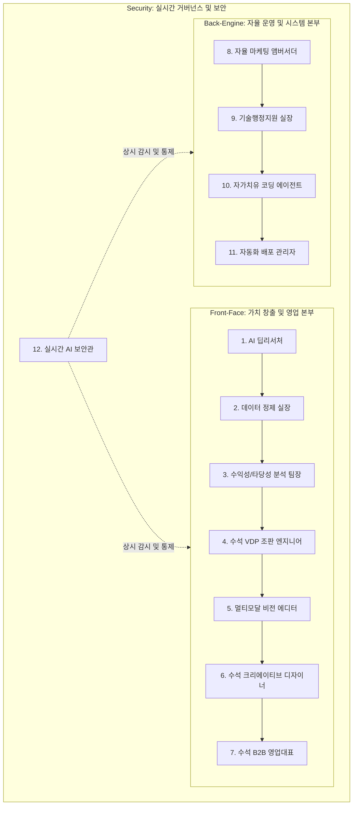

> **⚠️ 규칙 알림**: 이 프로젝트의 모든 마크다운(.md) 파일명은 반드시 한글로 작성하여 사장님과 AI 에이전트가 쉽게 인지하도록 합니다.
> **📌 현재 집중 목표**: 현장 영업용 실물 서비스 안정화 + 공모전용 AI 시연 UI 완성

> **단일 진실 공급원 (Single Source of Truth)**
> 본 문서는 저(Antigravity)와 대표님이 **제14회 범정부 공공데이터 AI활용 창업경진대회**를 준비하며 나눈 모든 기획, 아키텍처 설계, 회의 로그, 그리고 향후 계획을 영구적으로 누적하고 기억하기 위한 전용 공간입니다.
> 새 세션을 시작할 때 **"contest_master_brain.md 읽고 시작하자"**고 지시하시면 모든 맥락이 즉시 복원됩니다.

---

## 1. 프로젝트 개요 (Project Overview)
* **프로젝트명**: 출판친구 - 공공데이터 및 듀얼 AI 에이전트 기반 자율형 도서 복간 및 POD 플랫폼
* **참가 대상**: 제14회 범정부 공공데이터 AI활용 창업경진대회 (제품 및 서비스 개발 부문)
* **제출 기한**: 2026년 6월 20일 (본선 제출 마감)
* **핵심 비전**: 사장되는 지식 자산을 공공데이터와 AI로 복원하고, 1인 창업자도 개발/유지보수 인력 없이 자율 운영할 수 있는 차세대 출판·인쇄 생태계 구축

---

## 2. 핵심 아키텍처: 12대 AI GEM 자율 조직 (12-GEM Autonomous Organization)

본 플랫폼은 기획, 편집, 영업, 유지보수, 보안까지 각 분야의 전문 직책(Persona)을 부여받은 12개의 특화 AI 에이전트로 구성된 가상의 자율 조직으로 운영됩니다.

### 🔹 [Front-Face] 가치 창출 및 영업 본부 (7대 에이전트)
1. **AI 딥리서처 (AI Deep Researcher)**: 국립중앙도서관 API, 도서관 정보나루 실시간 대출 통계, 중고서적 트렌드를 상시 추적하여 수요가 입증된 절판도서 데이터를 자율적으로 발굴합니다.
2. **데이터 정제 실장 (Data Refinement Manager)**: 크롤링 및 수집된 비정형 데이터의 노이즈를 걸러내고, 플랫폼 표준 규격에 맞는 데이터 정제 및 DB 전처리를 수행합니다.
3. **수익성·타당성 분석 팀장 (Profitability/Feasibility Analysis Lead)**: 제작 단가, 예상 유통 마진, 저작권 상태를 종합 분석하여 복간 타당성 보고서(`Reprint Score`)를 생성해 의사결정을 돕습니다.
4. **수석 VDP 조판 엔지니어 (Chief VDP Typesetting Engineer)**: 텍스트 및 한글(HWP) 원고를 파싱하여 고해상도 인쇄 표준인 PDF/X-4 포맷으로 가변 조판(Variable Data Printing)을 자율 실행합니다.
5. **멀티모달 비전 에디터 (Multimodal Vision Editor)**: 화질이 저하된 스캔본 PDF를 OCR로 인식하고, 깨진 폰트나 노이즈가 발생한 영역을 실시간으로 보정 및 부분 수정 제어합니다.
6. **수석 크리에이티브 디자이너 (Chief Creative Designer)**: 도서 장르와 트렌드에 최적화된 저작권 프리 표지 시안을 생성하고 북 디자인 레이아웃을 완성합니다.
7. **수석 B2B 영업대표 (Chief B2B Sales Rep)**: 분석된 데이터와 복간 계획을 기반으로 출판사 의사결정자를 설득하기 위한 맞춤형 'AI 오디오 오버뷰(Audio Overview) 제안서'를 생성하여 B2B 영업을 수행합니다.

### 🔹 [Back-Engine] 자율 운영 및 시스템 본부 (4대 에이전트)
8. **자율 마케팅 앰버서더 (Autonomous Marketing Ambassador)**: 복간이 확정되면 카드뉴스, 인포그래픽, 소개 문구를 생성하여 SNS 및 커뮤니티 채널에 자율적으로 배포하고 예약 독자를 확보합니다.
9. **기술행정지원 실장 (Technical Admin Support Manager)**: 사용자의 웹 오류(CS)를 즉각 감지하며, 인쇄소와의 마찰을 줄이기 위해 안전 재고(10부 버퍼) 모니터링 및 실시간 관리를 수행합니다.
10. **자가치유 코딩 에이전트 (Self-Healing Coding Agent)**: 플랫폼 이용 중 발생한 버그를 역추적하여 코드를 수정하고 GitHub에 PR(Pull Request)을 생성합니다.
11. **자동화 배포 관리자 (Automated Release/Deployment Manager)**: 제작 효율을 극대화하기 위한 '5부 묶음 발주' 제어와 대표님 원클릭 승인에 기반한 무중단 서버 배포 관리를 전담합니다.

### 🔹 [Security] 실시간 거버넌스 및 보안 (1대 에이전트)
12. **실시간 AI 보안관 (Real-time AI Security Sheriff)**: 11개 에이전트 간의 프롬프트 주입 및 데이터 오염(교차 오염)을 차단하고, 소스코드 및 환경설정 내 API Key 노출 여부를 30초 단위로 초고속 스캔하여 보안 장벽을 구축합니다.

### 🔹 API 기반 자율형 파이프라인 아키텍처 규칙 (Autonomous API Pipeline Rule)
* **API 직접 연동 원칙**: Gemini 웹 브라우저의 'Gem'은 사용자가 수동으로 질의하기 위한 노코드 챗봇 빌더이므로, 에이전트 간의 실시간 기계적 연동이 불가능합니다. 따라서 **모든 에이전트 간 연계 및 자동화는 Google Gemini API를 소스 코드 단에 직접 주입하여 기계적으로 자동 호출(체이닝)되도록 구축**합니다.
* **대표님 무개입(Zero-Labor) 운영**: 대표님이 중간에서 텍스트나 로그를 복사-붙여넣기 하는 단순 행정 작업을 일체 배제합니다. 에러 발생부터 분석(9번) ➡️ 검증(12번) ➡️ 자동 패치 코드 생성(10번)까지의 파이프라인은 백엔드에서 완전히 자율적으로 실행됩니다.
* **원클릭 최종 의사결정 통제**: 파이프라인의 최종 단계(11번)에서만 대표님의 스마트폰(디스코드/메시징 채널 등)으로 패치된 코드 수정본과 함께 **[승인 / 반려]** 버튼이 도달하며, 대표님이 원클릭으로 이를 승인하는 즉시 무중단 배포가 완료되는 완벽한 자율 지향적 거버넌스를 구축합니다.

---

## 3. 히스토리 및 의사결정 로그 (Meeting Logs)

### 📅 2026-05-13
* **논의 주제**: 경진대회 출품 전략 및 유지보수 자동화 방안 논의
* **결정 사항**:
  * 유지보수를 자동화하여 대표님은 영업에만 집중하는 '자율형 AI 에이전트' 도입 확정.
  * 앞(Front: 공공데이터 발굴)과 뒤(Back: 자율 유지보수)를 아우르는 **듀얼 에이전트 시나리오** 채택.
  * 작업 공간 내 장기 기억 유지를 위한 마스터 파일(`contest_master_brain.md`) 개설.
  * 5단계 사업계획서 상세 목차 및 스토리텔링 전략 수립.
  * [1. 문제 인식] 파트의 현업 통찰 기반 본문 텍스트 정식 수록.
  * [2. 해결 방안] 파트의 듀얼 AI 에이전트 및 가상 인쇄 엔진 상세 스토리텔링 본문 수록.

### 📅 2026-05-14
* **논의 주제**: AI 헬퍼 UI 실물 구현 및 사업계획서 본문(3~5번) 완결
* **결정 사항**:
  * **Back Agent 시각화**: 'Antigravity' AI 헬퍼 FAB 및 자가 치유 시뮬레이션 패널 구현.
  * **에러 연동**: 파일 업로드 에러 시 AI가 자동 개입하여 패치 승인을 요청하는 워크플로우 완성.
  * **사업계획서 완결**: [3. 기술 혁신성], [4. 시장 분석 및 BM], [5. 성장 전략 및 기대 효과] 본문 수록 완료.
  * **테스트 준비**: 다음 주 다중 사용자 UAT를 위한 시스템 안정성 및 AI UI 노출 설정 확인.

### 📅 2026-05-15
* **논의 주제 1**: 구글 GEM과 안티그래비티의 하이브리드 협업 및 역할 분담 전략 확정
* **논의 주제 2**: 중장기 비전 '마이너리티 리포트 프로젝트(AI 자율 경영 통제실)' 수립
* **논의 주제 3**: 실전 영업 우선순위 설정 및 공모전 마감(6/20) 집중 전략 전환
* **결정 사항**:
  * **우선순위 조정**: 장기 비전은 '향후 계획'으로 보존하되, 당장은 출판사 대표 미팅을 위한 **실물 서비스 안정화**에 최우선 순위 부여.
  * **공모전 마감일 준수**: 6월 20일 최종 제출을 목표로, 안티그래비티는 매 세션 시작 시 **[공모전 준비 현황판]**을 브리핑하기로 함.
  * **시연 전략**: 복잡한 이론보다 안티그래비티가 실제로 에러를 잡고 서비스를 유지보수하는 '실물 AI 에이전트 UI' 시연에 집중.

### 📅 2026-05-22
* **논의 주제**: 마스터 브레인 분리 작업, 시스템 현황 갱신 및 9번 기술행정지원 실장 최종 완성
* **결정 사항**:
  * **문서 분리**: 빌드업/샌드박스용 `contest_master_brain.md`와 공식 기획서 작성용 `contest_master_draft_brain.md`로 역할 이원화 분리 완료.
  * **플랫폼 배포 및 DB 연동**: Vercel을 통한 실물 웹 호스팅 주소(`publish79.vercel.app`) 및 Supabase DB 연동 정보 기재.
  * **UAT 진행**: 테스터들에게 모의 테스트 양식을 전달하여 사용자 피드백(UAT) 수집 단계 돌입.
  * **[9번 실장 완성]**: 디스코드 웹훅 연동 및 CORS 우회(Vercel 서버리스 프록시) 적용 완료.
  * **[유저 케어 고도화]**: 에러 감지 시 각 사용자 세션 브라우저 상에서 안심 케어 패널(`ai-panel`)이 자동으로 팝업되도록 UI를 연동하고, 디스코드 알림 시 사용자 식별 정보(`userId`, `userRole`)가 함께 송신되도록 보완 완료 (시크릿 모드/새 창 테스트 성공).
  * **[진정한 API 기반 자율형 파이프라인 전환 결정]**: 구글 제미나이 웹의 Gem을 통한 수동 복사-붙여넣기 제어 방식은 1인 기업 대표의 업무 리소스를 과도하게 소모하므로 전면 배제함. 대신 **Google Gemini API를 직접 소스코드 단에 연동**하여 9번 ➡️ 12번 ➔ 10번 에이전트 간 백엔드 호출을 완전히 자동화하고, 최종 11번 단계에서만 대표님의 모바일 원클릭 승인 통제를 거치도록 개발 노선을 전격 갱신함.

---

## 4. 사업계획서 상세 목차 및 스토리텔링 (Business Plan Index)

### 1. 문제 인식 (Problem) : 사장되는 지식과 스타트업의 데스밸리

#### 1-1. 지식의 단명(短命)과 출판 생태계의 위축
글을 쓴다는 것은 작가의 오랜 학문과 열정을 담아내는 숭고한 작업입니다. 그러나 현재 출판 생태계는 콘텐츠의 본질적 가치보다 작가의 인지도와 즉각적인 ROI(투자 대비 수익)에 의존할 수밖에 없는 구조적 모순을 안고 있습니다.
과거 3,000부 단위였던 초판 인쇄물량은 500부, 심지어 300부까지 급감했습니다. 초기 판매가 부진한 도서는 악성 재고가 되어 막대한 창고 유지 비용을 발생시키고, 결국 빛을 보기도 전에 파쇄되어 **‘절판(Out of Print)’**이라는 이름으로 영영 사장됩니다. 양질의 도서가 꽃처럼 피어나기도 전에 사라지는 문화적·경제적 손실이 가속화되고 있는 것입니다.

#### 1-2. 20년째 갇힌 POD(주문형 인쇄)의 딜레마: "왜 여전히 비싼가?"
이러한 재고 부담을 해소하기 위해 20년 전 출판계에 **POD(Publishing On Demand)** 개념이 도입되었습니다. 초창기 복사기 수준의 토너 인쇄에서 출발해, 현재는 HP 인디고 등 대형 전자잉크 디지털 장비의 도입으로 도서의 ‘날개’까지 완벽히 구현할 만큼 품질이 혁신적으로 발전했습니다.
하지만 출판사가 체감하는 POD는 여전히 **"비싸서 쓸 수 없는 계륵"**입니다.
* **출판사의 한계**: 정가 10,000원 도서를 소량 제작할 때 권당 제작비가 6,000원에 달하면, 유통 수수료와 마케팅비를 제외할 경우 출판사는 적자를 면치 못합니다.
* **인쇄소의 한계**: 고가의 디지털 장비 감가상각, 값비싼 전자잉크 소모품, 인건비를 감당하기 위해서는 소량 발주 건당 단가를 높일 수밖에 없습니다.
> **핵심 문제 정의**: *"파편화된 소량 발주 구조 속에서는 인쇄소의 가동률이 떨어지고 단가가 상승하여, 결국 누구도 만족하지 못하는 가격의 장벽이 발생합니다."*

#### 1-3. 출판친구의 명쾌한 해답: ‘소량의 집결’을 통한 규모의 경제
여기에 **출판친구**의 명확한 존재 이유가 있습니다. 
개별 출판사의 발주 물량은 10권, 50권으로 작지만, **출판친구 플랫폼을 통해 전국의 소량 발주가 하나의 데이터로 집결되어 인쇄소로 넘겨지는 총물량은 결코 작지 않은 ‘대량 발주’가 됩니다.**
* **인쇄소**: 안정적인 통합 조판 물량을 확보하여 장비 가동률을 극대화하고 단가를 낮출 수 있습니다.
* **출판사**: 대량 인쇄 수준의 합리적인 단가로 소량 POD를 이용할 수 있게 됩니다.
* **결과**: 공공데이터로 발굴한 롱테일·절판 도서를 부담 없이 복간하여 출판사와 저자에게는 지속 가능한 수익을, 독자에게는 사장되었던 지식을 선사합니다.

### 2. 해결 방안 (Solution) : 전방위 자율형 AI 에이전트 생태계

> **스토리텔링 한 줄 요약**: *"공공데이터로 수요를 찾고, POD 엔진으로 모아서 찍어내며, 서비스 운영은 AI가 스스로 유지보수합니다."*

#### 2-1. 도입 배경 : 1인 창업자의 물리적 한계 돌파
* **영업 및 확장성의 딜레마**: 출판사 방문 영업을 통해 롱테일·절판 도서의 POD 복간에 대한 높은 공감대를 이끌어냈으나, 혼자서 전국의 수많은 출판사를 설득하고 물량을 모으기에는 물리적 시간이 턱없이 부족합니다.
* **단가 방어의 불확실성**: 물량 집결 속도가 느리면 인쇄소를 설득할 수 있는 ‘규모의 경제’ 도달 시점을 예측하기 어렵고, 합리적인 POD 단가를 지속 유지하기 어렵습니다.
* **해결책 (Agentic Workflow 전환)**: 30일간 매진하여 구축한 ‘출판친구 POD 핵심 엔진’의 가치를 극대화하기 위해, **영업·기획·편집·CS·유지보수를 전방위로 전담하는 다중 AI 에이전트(Multi-Agent) 시스템**으로 전면 전환합니다.

#### 2-2. 12대 AI GEM 자율 조직을 통한 전방위 운영 혁신
'출판친구'는 1인 기업이 가질 수 있는 물리적 영업 한계와 고액의 IT 인프라 유지비용 문제를 아래의 12대 AI GEM 협업 구조로 완벽히 돌파합니다.

*   **Front-Face 영업 본부**: 기획서 발송 및 영업 단계에 **'AI 오디오 오버뷰 제안서'**를 최초 도입하여 대형 출판사들의 주목을 끌고, **VDP 가변 조판** 및 **멀티모달 비전 OCR**을 통해 수작업이 많이 가던 도서 복원 단계를 제로화(Zero-labor)합니다.
*   **Back-Engine 시스템 본부**: 사용자의 실시간 장애 대응뿐만 아니라, 인쇄소와의 실물 제작 효율을 끌어올리기 위한 **'10부 안전 재고 버퍼 관리'**와 **'5부 묶음 자동 발주'** 로직을 관리합니다.
*   **Security 거버넌스 체제**: 다중 에이전트 운영 시 우려되는 환경 변수 오염 및 API 키 탈취 위협을 **'실시간 AI 보안관'**이 30초 주기로 전수 검사하여 데이터 보안성을 세계 최고 수준으로 유지합니다.

> **궁극적 가치 창출**: *"기획, 데이터 정제, 조판, 교정, 디자인, B2B 제안서 발송, 마케팅, 고객 대응, 에러 수정, 보안 검사까지 에이전트에게 100% 위임하고, 대표님은 오프라인 VIP 제휴와 사업 방향 승인에만 집중하는 초효율 1인 대기업 모델을 완성합니다."*

### 3. 기술 혁신성 및 차별성 (Tech & Innovation)

> **핵심 기술 가치**: *"파편화된 공공데이터를 수익원으로 정제하고, 기술 인력 없이 시스템을 유지하는 AI 자율 운영 기술"*

#### 3-1. 공공데이터 기반 롱테일 수요 예측 알고리즘 (Front Innovation)
단순한 API 연동을 넘어, 서로 다른 성격의 공공데이터를 융합하여 '잠들어 있는 수익'을 발굴하는 독자적인 데이터 정제 기술을 보유합니다.
*   **멀티 소스 데이터 퓨전(Data Fusion)**: 국립중앙도서관의 **'국가서지데이터(정적 정보)'**와 도서관 정보나루의 **'실시간 대출 통계(동적 정보)'**, 그리고 대형 온라인 서점의 **'품절/검색 트렌드'**를 결합.
*   **복간 수익성 점수(Reprint Score)**: 위 데이터를 기반으로 독자 수요를 예측하고 사업 타당성 분석 결과를 자동으로 산출하는 정교한 데이터 모델링 기술입니다.

#### 4. 시장 분석 및 사업 모델 (Market & BM)

#### 4-1. 목표 시장 (Target Market)
*   **1차 타깃**: 전국 1인 영세 출판사 및 자가출판(POD)을 희망하는 개인 저자군.
*   **2차 타깃**: 절판 서적 보유 비율이 높은 중소형 출판사 및 대학 출판부.
*   **최종 목표**: 단순한 플랫폼을 넘어, 1인 창업자의 두뇌와 손발이 되는 **'자율 경영 엔진'**으로의 진화.

#### 4-2. 수익 모델 (Revenue Stream): 지속 가능한 3단계 매출 구조
1.  **지식 자산 복원 수익 (Reprint Royalty)**: 공공데이터로 발굴한 절판 도서의 복간 프로젝트를 주도하고, 판매 시 발생하는 수익을 원저작권자와 분배합니다. (IP 기반 고수익 모델)
2.  **용지 유통 통합 및 선결제 중개 (Paper Aggregation)**:
    *   **전략**: 소규모 출판사가 개별적으로 받기 힘든 **'용지 할인율 35%'**를 플랫폼 차원에서 즉시 제공합니다.
    *   **메커니즘**: 사용자가 플랫폼에서 용지 대금을 **선결제**하면, 출판친구는 이를 취합하여 파트너 유통사(페이퍼프라이스)에 발주하고 사용자가 지정한 인쇄소로 직배송합니다.
    *   **Win-Win**: 유통사는 선결제로 미수금 리스크가 제거된 대량 물량을 확보하고, 출판사는 대형 출판사 수준의 원가 절감 혜택을 누립니다.
3.  **POD 주문 중개 및 공정 관리 수수료 (Brokerage Fee)**: 용지 공급과 연계된 인쇄 공정 전반을 관리하며 발생하는 중개 수수료를 수취합니다. 가상 인쇄 엔진을 통한 단가 최적화 과정에서 추가 마진을 확보합니다.
4.  **에이전틱 운영 솔루션 (Future SaaS)**: (중장기) 소규모 온라인 비즈니스 운영자들에게 우리가 개발한 'Back Agent(자가 치유 유지보수 시스템)'를 솔루션 형태로 제공하는 구독 모델로 확장합니다.

#### 4-3. 초효율 비용 구조와 수익 극대화 (Efficiency)
우리가 구현한 듀얼 AI 에이전트 시스템은 전통적인 플랫폼 운영 대비 압도적인 비용 우위를 가집니다.
*   **인건비 90% 이상 절감**: 
    *   **영업/기획**: Front Agent가 24시간 공공데이터를 뒤져 제안서를 보내므로 영업팀 3명의 역할을 대신함.
    *   **유지보수**: Back Agent가 시스템 에러를 스스로 고치므로 상주 개발자 1명의 역할을 대신함.
*   **마진율 방어**: 기술로 절감된 고정비(연간 약 2억 원 이상 예상)를 인쇄 단가 인하에 재투자함으로써, 경쟁사 대비 가격 경쟁력을 확보하면서도 높은 순이익률을 유지합니다.

> **BM 한 줄 요약**: *"AI가 일하고 사람이 승인하는 구조를 통해, 최소 비용으로 문화적 가치(복간)와 경제적 실익(수수료)을 동시에 잡는 하이테크 플랫폼 모델입니다."*

### 5. 성장 전략 및 기대 효과 (Growth & Impact)

> **미래 비전**: *"지식의 수명을 연장하고, AI 에이전트와 인간이 공존하는 가장 효율적인 창업 모델을 전파합니다."*

#### 5-1. 사회적 가치 및 ESG 경영 (Social & Environment)
*   **[S] 문화적 자산의 보존 (Social)**: 절판이라는 이름으로 사장될 뻔한 소중한 지식 공공데이터를 발굴하여 다시 세상에 내놓음으로써, 국가적 지식 문화유산의 수명을 연장하고 지식의 평등한 향유권을 보장합니다.
*   **[E] 탄소 저감형 친환경 인쇄 (Environment)**: 대량 인쇄 후 팔리지 않아 파쇄되는 도서 재고 문제를 원천 차단합니다. **'딱 필요한 만큼만 찍는(Zero-waste)'** POD 모델을 통해 종이 낭비와 탄소 배출을 획기적으로 줄이는 친환경 인쇄 생태계를 구축합니다.
*   **[G] 1인 창업 생태계 활성화 (Governance)**: 고가의 개발 인력 없이도 AI 에이전트와 함께 기술 기반 스타트업을 운영할 수 있는 '자율형 비즈니스 모델'의 표준을 제시하여, 1인 기업의 자생력을 높이고 새로운 일자리 패러다임을 만듭니다.

#### 5-2. 단계별 스케일업 로드맵 (Roadmap)
1.  **초기 (2024~2025): 지식 복원 시장 점유**
    *   공공데이터 기반 절판 도서 복간 성공 사례 100건 달성.
    *   인쇄 파트너사 네트워크 확대를 통한 POD 제작 단가 추가 인하.
2.  **중기 (2026~2027): 서비스 영역의 다각화**
    *   도서를 넘어 패키징, 개인 맞춤형 굿즈(Goods) 등 소량 맞춤 인쇄가 필요한 전 영역으로 가상 인쇄 엔진 및 에이전트 시스템 확장 적용.
    *   AI 조판 에이전트의 고도화로 편집 디자인 자동화 서비스 런칭.
3.  **장기 (2028~): 에이전틱 솔루션 라이선싱**
    *   우리가 구축한 'Back Agent(자가 치유 시스템)'를 타 산업 분야(쇼핑몰, 소형 SaaS 등) 1인 창업자들에게 솔루션 형태로 공급하여 기술 기반 플랫폼으로 도약.

#### 5-3. 기대 효과 (Expected Impact)
*   **문화적 효과**: 연간 1,000권 이상의 사장된 도서 복간을 통한 지식 생태계 선순환.
*   **경제적 효과**: 유지보수 및 영업 인건비 절감을 통한 1인 기업 영업이익률 40% 이상 확보 가능성 입증.
*   **기술적 효과**: 범정부 공공데이터와 최신 AI 에이전트 기술이 결합한 가장 혁신적인 공공데이터 활용 비즈니스 사례로 자리매김.

> **최종 결언**: *"출판친구는 기술로 지식을 구하고, AI로 사람의 시간을 구합니다. 우리는 대한민국 출판·인쇄 산업의 새로운 표준이 되겠습니다."*

---

## 5. 🚀 실전 운영 및 에이전트(9,10,11,12번) 개발 로드맵 (4개년/4주 로드맵)

다음 주 출판사 2곳의 실전 UAT 테스트 시작에 맞추어, 대표님의 현장 영업 리소스를 방어하고 공모전 시연을 준비하기 위한 4주 시간관리 로드맵입니다.

### 📅 Week 1 (5/25 ~ 5/29): 출판사 실전 UAT 개시 & [9번 실장] 감지 MVP 구축
*   **목적**: 출판사 테스터가 주문 및 파일 업로드 시 겪는 실시간 에러의 즉각 수집 및 차단.
*   **세부 태스크**:
    *   [x] 출판사 2곳에 플랫폼 계정 전달 및 UAT 주문 테스트 실행.
    *   [x] 백엔드(Supabase/Vercel) 에러 트래킹 미들웨어 및 감지 코드 연동.
    *   [x] **[9번 기술행정지원 실장]**: 에러 로그 발생 즉시 디스코드 모바일 알림 연동 완료. (DB 적재는 10번 에이전트 연계 과정에서 추가 진행 예정)
    *   [x] 출판사 담당자 브라우저 화면에 "AI 기술팀이 수정을 시작했습니다" 팝업 메시지 출력 UI 연결 (실제 에러 감지 시 AI Helper 패널 자동 연동 완료).

### 📅 Week 2 (6/1 ~ 6/5): [10번 코딩 GEM] & [12번 보안 GEM 1차] 결합
*   **목적**: 에러 발생 시 수동 디버깅을 없애고 AI가 자가치유 패치 코드를 제안하도록 구현.
*   **세부 태스크**:
    *   [ ] **[10번 자가치유 코딩 에이전트]**: DB에 수집된 에러 로그와 소스코드를 Gemini API에 넘겨 수정 코드를 자동 생성하게 설정.
    *   [ ] **[12번 실시간 AI 보안관 1차]**: 9번이 낚아챈 에러가 인젝션 공격인지 검증하는 보안 필터 적용.
    *   [ ] 로컬 가상 환경에서의 자동 테스트 스크립트 실행 및 결과 검증 로직 구현.

### 📅 Week 3 (6/8 ~ 6/12): [11번 배포 GEM] '대표님 원클릭 승인' & [12번 보안 GEM 2차] 완결
*   **목적**: 대표님이 외부에서 에러 조치 내역을 모바일로 승인하면 실서버에 즉각 무중단 배포하는 루프 완성.
*   **세부 태스크**:
    *   [ ] 슬랙/카카오톡 모바일 메시지 내 **[승인 / 반려]** 액션 버튼 추가.
    *   [ ] **[12번 실시간 AI 보안관 2차]**: 10번이 수정한 코드에 API Key, 비밀번호 등 민감정보 노출 검사 필터 연동.
    *   [ ] **[11번 자동화 배포 관리자]**: 대표님 [승인] 클릭 시 GitHub 커밋 푸시 및 Vercel API 호출을 통한 무중단 배포 연동.

### 📅 Week 4 (6/15 ~ 6/20): 예선 통과용 자가치유 라이브 데모 영상 제작 및 기획서 마감
*   **목적**: 실제 구동 데이터를 바탕으로 공모전 기획서 수치화 및 실물 데모 증명 완료.
*   **세부 태스크**:
    *   [ ] **종합 검증**: 인위적 에러 발생 시 `9 ➡️ 12 ➡️ 10 ➡️ 12 ➡️ 11 ➡️ 실서버 배포`로 이어지는 풀 사이클 구동 테스트 및 안정화.
    *   [ ] 발표 현장 시연을 대체할 **'2분 분량 자가치유 시연 녹화 영상'** 제작 (예비 플랜 확보).
    *   [ ] UAT에서 확보된 실제 주문 성공률, 응답 속도, 비용 절감(API 호출 건당 1.56$ 수준) 팩트를 기획서에 최종 갱신.
    *   [ ] 6월 20일 공모전 예선 최종 제출 완료.

---

## 6. 🔒 비공개 전략 자산 및 마일스톤 (Secret Assets - 사업계획서 미포함)

> **Antigravity의 영구 기억 영역**
> 본 섹션은 공모전 심사위원 제출용 사업계획서에는 포함되지 않으며, 오직 대표님과 저 Antigravity가 프로젝트의 중장기적 가치 창출과 독점적 권리 보호를 위해 비공개로 관리하는 전략 로드맵입니다.

### 🔹 1. 지식재산권(IP) 구축 : BM 및 소프트웨어 특허 출원
* **출원 전략**: 공공데이터 API 실시간 수집 ➡️ AI 수요 예측 및 타당성 검토 ➡️ 인쇄용 파일 자동 조판(재편집) ➡️ 특화 에이전트 연계 발주로 이어지는 고유의 시계열적 알고리즘을 BM 특허 및 소프트웨어 특허로 출원.
* **명세서 AI 작성 지원**: 변리사 미팅 및 출원에 필요한 [발명의 명칭, 배경 기술, 동작 순서도, 청구항 초안]을 Antigravity가 설계 데이터를 기반으로 완벽히 초안 작성 지원.
* **향후 계획**: 개발 진척도(UAT 결과 등)에 따라 명세서 내용을 지속적으로 업데이트 및 고도화 예정.
* **기대 효과**: 공모전 심사 시 기술적 진입장벽 입증 및 외부 공개에 따른 아이디어 도용 원천 차단 (출품 전 가출원 권장).

### 🔹 2. 브랜드 스토리텔링 자산화 : [AI와 함께 쓴 플랫폼 개발기] 도서 출간
* **출간 콘셉트**: "코드 한 줄 쓸 줄 모르는 1인 창업가가 제미나이와 Antigravity(AI 에이전트)와의 대화만으로 자율형 POD 플랫폼을 완성한 실제 발자취"를 담은 실전 창업 에세이 및 기술 가이드북.
* **원고 추출 메커니즘**: 로컬 경로에 영구 누적되는 대화 로그(`overview.txt`)와 제미나이 문답을 Antigravity가 챕터별로 정제하고 극적인 스토리로 가공.
* **Dogfooding 브랜딩**: 완성된 도서 원고를 바로 우리가 만든 **출판친구 플랫폼**에 얹어 자체 POD 인쇄로 첫 출간함으로써, 플랫폼의 기술력과 비전을 세상에 증명하는 최고의 마케팅 무기로 활용.

### 🔹 3. 비전 2027 : 마이너리티 리포트 프로젝트 (AI 자율 경영 통제실)
* **콘셉트**: 대표님이 음성으로 비즈니스 현황을 묻고, AI 에이전트 그룹이 실시간 데이터 분석을 통해 브리핑하며 의사결정을 지원하는 '지능형 워룸(War Room)' 구축.
* **주요 미래 기능**:
    *   **Voice BI**: "오늘 절판 도서 수요 어때?" 등의 음성 질문에 실시간 데이터 기반 즉각 답변.
    *   **영업 파이프라인 트래킹**: 제안서 발송 후 반응(클릭률, 회신 등)을 분석하여 후속 전략 자동 제안.
    *   **예측형 경영 지원**: 온라인 유입 패턴을 분석하여 향후 주문량을 예측하고 인쇄소 가동률 선확보 권고.
    *   **시스템 자가 진단**: 주간 에러 발생 및 자가 치유(Self-healing) 현황 요약 보고.
* **최종 목표**: 단순한 플랫폼을 넘어, 1인 창업자의 두뇌와 손발이 되는 **'자율 경영 엔진'**으로의 진화.

---
