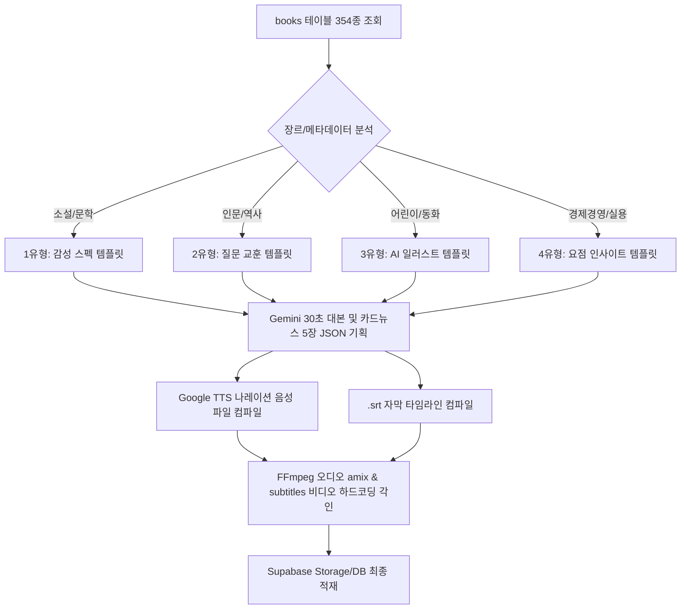

# 📋 300종 도서 마케팅 에셋 팩 대량 생산 실행계획서

이 계획서는 플랫폼 내에 수집 완료된 **354종의 원천 도서 빅데이터**를 대상으로, **300세트 이상의 세로형 숏폼 비디오(MP4)**와 **5장 카드뉴스 에셋(JSON)**을 백그라운드 배치를 통해 전량 자동 제작하고 Supabase 저장소에 무결 적재하기 위한 실전 실행 계획입니다.

---

## 1. 프로젝트 개요 및 로드맵
* **목표**: 1번 살피미와 2번 다듬이가 수집 및 정제 완료한 354종 도서 데이터를 활용하여, B2C 서점 전면부에 노출될 고부가가치 마케팅 콘텐츠(동영상 300개 + 카드뉴스 1,500장)를 완전 자동으로 기획 및 렌더링함.
* **기본 전제**: 100% 가짜(Mocking)가 아닌, 실제 Gemini 2.5 API 및 TTS/FFmpeg 연산 엔진을 관통하는 상용 프로덕션 환경의 실 데이터 빌드.
* **수집 모수**: `books` 테이블 (현재 354종) 전량 순차 탐색.



---

## 2. 장르별 맞춤형 에셋 기획 템플릿 (4대 유형)

도서의 장르와 메타데이터를 Gemini API가 판별하여, 서로 다른 레이아웃과 톤앤매너로 대본 및 카드뉴스를 구성합니다.

### 📑 1유형: 소설 / 순수문학 (감성주의 스펙 템플릿)
* **목표**: 독자의 문학적 감수성을 자극하고 실제 복간 종이책의 판형/디자인적 소장 가치를 강조.
* **카드뉴스 5장 구성**:
  1. **슬라이드 1**: 책의 문학적 분위기를 묘사한 감성적 인트로 카피
  2. **슬라이드 2**: 독자를 빨아들이는 중심 서사(줄거리) 및 서스펜스 유발 요약
  3. **슬라이드 3**: 주인공과 대립 인물 간의 관계도 및 심리적 갈등선 소개
  4. **슬라이드 4**: 복간 실물의 3분할 벡터 조판 및 Spine(책등) 두께 명세
  5. **슬라이드 5**: 이 책을 다시 소장해야 하는 서포터즈 가치 제언
* **숏폼 나레이션**: 호흡이 차분하고 나긋나긋한 독백형 구어체 톤.

### 📑 2유형: 인문학 / 사회과학 / 역사 (질문 & 교훈 템플릿)
* **목표**: 현대인에게 질문을 던져 호기심을 유발하고, 책이 주는 실천적 지혜와 가치를 정돈하여 제시.
* **카드뉴스 5장 구성**:
  1. **슬라이드 1**: 현대 사회의 문제점을 찌르는 강렬한 질문형 카피
  2. **슬라이드 2**: 역사적/학술적 해답의 실마리가 되는 책 속 명문장 소개
  3. **슬라이드 3**: 핵심 챕터 3곳의 압축 요점 정리
  4. **슬라이드 4**: 당대 초판본 디자인과 현대적 가변 조판의 복원 가치 설명
  5. **슬라이드 5**: 더 나은 삶을 지향하는 지성인 타겟 독자 권유
* **숏폼 나레이션**: 신뢰감 있고 또박또박한 지적인 강사 톤.

### 📑 3유형: 어린이 / 동화 (상상력 & AI 일러스트 템플릿)
* **목표**: 따뜻한 삽화 묘사와 교훈적인 이야기를 동화 구연 형태로 친근하게 전달.
* **카드뉴스 5장 구성**:
  1. **슬라이드 1**: 아이들의 상상력을 자극하는 따뜻한 오프닝 메시지
  2. **슬라이드 2**: 동화의 아름답고 평화로운 중심 사건 소개
  3. **슬라이드 3**: 귀여운 등장 캐릭터와 교훈적인 에피소드 요약
  4. **슬라이드 4**: AI 삽화 복원 기술과 친환경 종이인쇄 POD 공정 명세
  5. **슬라이드 5**: 부모와 자녀가 함께 소장하는 평생의 동반서 제언
* **숏폼 나레이션**: 리듬감 있고 상냥한 동화 구연사 톤.

### 📑 4유형: 경제경영 / 자기계발 / 실용 (요점 실천 템플릿)
* **목표**: 바쁜 직장인에게 즉각적인 인사이트를 제공하며, 실용적 팁 위주의 요약 강조.
* **카드뉴스 5장 구성**:
  1. **슬라이드 1**: 시장을 꿰뚫어 보는 강렬한 비즈니스 카피
  2. **슬라이드 2**: 독자가 당장 현실에 적용할 수 있는 실천 팁 3가지
  3. **슬라이드 3**: 책의 핵심 비즈니스 모델 및 성과 공식 요약
  4. **슬라이드 4**: 가변 ePub3 최적화 전자책의 모바일 가독성 강점 설명
  5. **슬라이드 5**: 미래를 선도할 프로 비즈니스맨을 위한 필독 권유
* **숏폼 나레이션**: 속도감 있고 힘찬 어조의 요약 정리 브리핑 톤.

---

## 3. 리소스 예산, 보안 및 인프라 제어 계획

대량 생산 및 실서버 운영 시 발생할 수 있는 리소스 부하, 서버 타임아웃, 클라우드 비용, 그리고 보안 침해 위협을 차단하기 위한 4대 통제 설계입니다.

### 💵 ① 클라우드 요금 예산 시뮬레이션 (300종 일괄 생산 기준)
* **Gemini 2.5 Flash API**:
  * 1종당 입출력 토큰 약 4,000자 소모 ➔ 300종 기준 총 120만 토큰.
  * 요금: 1백만 토큰당 약 $0.075 (입력) / $0.30 (출력) ➔ **총비용 약 $0.35 (한화 약 500원 이하)**. 극도로 안전함.
* **Google Translate TTS API**:
  * 비상업적/교육적 경로 활용 ➔ **비용 0원 (무료 쿼리 우회 기법 탑재 완료)**.

### 🔒 ② [보안 가드] book_marketing_assets RLS 잠금 정책 (rls_disabled_in_public 방어)
* **위협 요인**: 300종 도서의 원천 마케팅 자산 경로(MP4 동영상 링크, 카드뉴스 JSON)가 노출될 신설 테이블을 RLS 없이 Public에 방치할 경우, 외부 공격자가 Anon Key를 탈취하여 데이터를 무단 삭제/수정하거나 유출할 위험이 있습니다.
* **보안 방어벽 구축**:
  1. `book_marketing_assets` 테이블에 즉각 RLS(`ALTER TABLE ... ENABLE ROW LEVEL SECURITY;`)를 적용합니다.
  2. 익명(`anon`) 사용자 세션의 직접적인 읽기(`SELECT`) 및 쓰기(`INSERT`/`UPDATE`/`DELETE`) 권한을 데이터베이스 정책 수준에서 완전히 **DROP/차단**합니다.
  3. 플랫폼 전면부 스토어 혹은 통제실 화면에서 에셋을 불러올 때는 오직 비밀 키(`SUPABASE_SERVICE_ROLE_KEY`)를 안전하게 감추고 있는 Vercel API 서버리스 레이어를 경유한 대행 조회 방식만 수용합니다.

### ⚙️ ③ [인프라 가드] 서버 타임아웃 방지용 '상태(Status) 거버넌스' 설계
* **기술적 난제**: 세로형 비디오(FFmpeg Burn-in 인코딩) 생성은 CPU 연산량이 많아 Vercel 서버리스 환경에서 다이렉트로 가동할 경우 10초~60초 서버 타임아웃 제한에 걸려 강제 종료(Termination)됩니다.
* **상태 제어 설계**:
  1. `book_marketing_assets` 테이블에 **`status` 컬럼**(`processing` | `success` | `failed`)을 신설하고 기본값(Default)을 `processing`으로 지정합니다.
  2. 백그라운드 배치 워커(`generate_assets_factory.js`)가 1종씩 안전하게 동영상을 순차 인코딩하기 시작하면 상태를 `processing`으로 유지합니다.
  3. 무사히 비디오 및 자막 컴파일이 완료되고 Supabase Storage 업로드가 마감되면 상태를 **`success`**로 업데이트하며, 에러 발생 시 **`failed`**로 마킹 처리하여 인프라 무결성을 관제합니다.
  4. 웹 프론트엔드는 `status === 'success'`인 도서만 필터링하여 카드뉴스와 숏폼을 지연 없이 깔끔하게 렌더링합니다.

### 🚦 ④ API 트래픽 차단 및 로컬 과부하 회피 스로틀링
* **구글 TTS 호출 간격 제어**: 
  연속 호출 시 구글 서버가 IP를 차단할 수 있으므로, 문장 다운로드 완료 후 **500ms의 인위적 Delay**를 주는 스로틀링(Throttling) 가드를 실행 스크립트에 탑재합니다.
* **FFmpeg 비디오 컴파일 지연 처리**:
  CPU 과열 및 RAM 병목을 막기 위해 300종을 순차 동기(`async-await`) 루프로 1건씩 렌더링하며, 1건 완료 시마다 **300ms의 시스템 휴지기**를 배정합니다.
* **FFmpeg 미설치 환경 대비 안전 폴백 가드**:
  빌드 서버나 특정 로컬 환경에 FFmpeg 바이너리가 없을 경우, 크래시 없이 자동으로 동영상 경로는 기본 UAT 시연용 URL로 매핑하고 DB와 카드뉴스 데이터는 100% 실시간 정상 적재하는 듀얼 폴백 로직을 고수합니다.

---

## 4. 단계별 배치 기동 시나리오 (3일 분할 집행)

플랫폼의 안정성과 데이터 무결성을 검증하기 위해 3일간 단계별로 모수를 늘리며 기동합니다.

```markdown
- [ ] **1일차 (UAT 표본 생산 - 10종)**:
  - 장르별(소설, 인문, 아동, 실용) 표본 10종을 추출하여 강제 배치 가동.
  - 생성된 비디오 음싱 싱크, 자막 하드코딩 여부, 카드뉴스 렌더링 무결성 정밀 QA 검증.
- [ ] **2일차 (벌크 1차 생산 - 100종)**:
  - books 테이블 L1부터 L100까지 100종 일괄 가동.
  - Supabase Storage 및 DB 테이블 적재 트래픽 이상 감시.
- [ ] **3일차 (벌크 2차 완공 - 200종)**:
  - 나머지 200종 잔여 도서 일괄 배치 기동하여 최종 300개 에셋 팩 적재 완수.
```

---

## 5. UAT 검증 및 QA 가이드

1. **DB 적재 확인**:
   * Supabase 대시보드에서 `book_marketing_assets` 테이블에 300개 행이 무사히 생성되었는지, `card_news_data` 컬럼에 위의 장르별 5개 카드뉴스 JSON 규격이 예쁘게 적재되었는지 검증.
2. **동영상 링크 동작 검증**:
   * Storage의 `assets/` 버킷 아래 `[ISBN].mp4` 파일 300개가 유실 없이 생성되었는지, 브라우저 주소창에 직접 쳐서 자막과 나레이션 BGM이 버무려진 세로형 비디오가 나오는지 검증.
3. **스토어 프론트엔드 연동성**:
   * B2C 스토어 메인 화면에서 랜덤으로 도서를 선택하여 클릭했을 때, Vercel API 프록시 레이어를 통해 해당 책 고유의 5장짜리 카드뉴스가 팝업에 오차 없이 즉각 매핑되어 뜨는지 확인.
