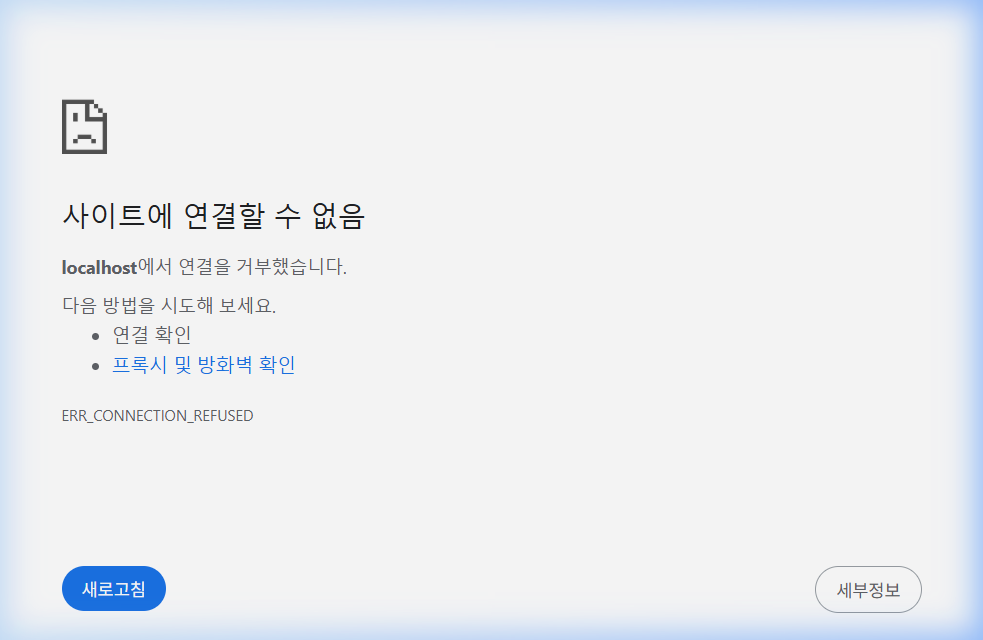


# [붙임 2-1] 신기술활용 우수사례 기획서

| 제4회 문화체육관광 인공지능·데이터 활용 공모전 - 신기술활용(ADX) - |
| --- |

# 

# 

| 공모 부문 | 신기술활용(ADX) 우수사례 |
| ---보 | --- |
| 사 례 명 | 공공데이터와 AI 에이전트를 활용한 절판 도서 복간 플랫폼, “출판친구” |
| 제품·서비스 유형 * 해당란에  표시 ※ URL 필수 기재 | □ 모바일 앱(APP)    URL 주소: |
|  | ■ 웹    URL 주소:  https://publish79.vercel.app |
|  | ■ 기타  <b>[평가위원 전용 실시간 온라인 데모 및 기능 검증 안내]</b> 1. URL 주소: https://publish79.vercel.app/adx-demo.html (접속 시 별도 로그인 없이 심사위원 전용 culture 계정 자동 로그인) 2. 주요 검증 동선 및 핵심 기능 ○ <b>1. [B2B 통제실]</b>: 17대 에이전트 협업 관제 및 [🚀 파이프라인 실행]을 통한 실시간 API 수집 상태 확인 ○ <b>2. [실무 기능 검증]</b>: 통제실 내 [A5 최적화 PDF 자동 조판/즉시 다운로드] 및 [ePub| ■ 서비스 구성 및 단계별 흐름    <b>1. 플랫폼 연동 구조 및 자율 협업 개요</b>   ○ 구글 제미나이(Gemini) API와 AI 개발 프레임워크인 안티그래비티(Antigravity)를 기반으로 구축하였습니다.   - 본 플랫폼은 1인 경영자(최종 승인자)와 안티그래비티 프레임워크 기반의 17대 협업 AI 에이전트 군단(출판친구 엔진)이 유기적으로 소통하며 작동하는 구조입니다.   - 효율성과 가독성을 위해 제작 아키텍처를 [종이책 복간 POD 사업부]와 [디지털 ePub 사업부]의 이원화된 스마트 팩토리 형태로 구성하여 병렬 가동합니다.    <b>2. 사업부별 단계별 자율 서비스 흐름 및 원고 기반 동적 분기</b>   <b>가. [종이책 복간 POD 사업부] 프로세스</b> (B2B 출판사 기존 도서 복간 & B2C/B2G 공유 도서 제작)   - <b>1단계 (수집/정제/분석)</b>: 1번 살피미가 도서관 대출 빅데이터에서 절판 도서를 탐지하고, 2번 다듬이가 표준 서지 메타데이터 정제 및 저작권 Heuristic 분류를 수행하며, 3번 계산이가 인쇄 요율 기반의 종이책 BEP 시뮬레이션을 진행합니다.   - <b>2단계 (의사결정/제안)</b>: 16번 판다(지휘)가 비즈니스 컨텍스트를 종합하여 의사결정 카드를 생성하고, 대표자(운영자)가 이를 최종 승인하면 10번 영업이가 출판사에 맞춤형 BEP 복간 제안서를 발송합니다.   - <b>3단계 (판형 최적화 및 자동 조판)</b>: 출판사 1차 승인 시 A5 판형 최적화(33.3% 절감안)를 추천하고, 동의 시 8번 이지퍼비터_POD가 원본 PDF를 A5 규격(93% 축소 및 여백 보정)으로 자동 조판하여 최종 PDF를 컴파일하고 출판사의 최종 승인을 받습니다.     * <i>(텍스트/원서 유입 시)</i>: 4번 조판이(조판), 5번 고치미(교정), 6번 번역이(번역), 7번 그림이(일러스트/삽화)가 차례대로 가동하여 인쇄용 완제품 PDF를 새로 생성하는 Full Compile 트랙으로 동적 전환됩니다.   - <b>4단계 (마케팅 및 예약 등록)</b>: 11번 알리미가 숏폼/카드뉴스 홍보물을 생성하여 배포하고, B2C 독자 예약 결제(빌링키)를 등록합니다.   - <b>5단계 (결제/제작 및 배송)</b>: 목표치(BEP) 달성 시 예약 결제를 일괄 격발하고, 파트너 인쇄소에 자동 발주를 진행하여 무재고 롱테일 제작 및 독자 직배송을 완료합니다.    <b>[표 1] 종이책 복간 공정 대비표 (기존 수작업 vs 에이전트 자율)</b>   <table border="1" cellpadding="6" style="border-collapse: collapse; font-size: 11px; width: 100%; border-color: #ddd;"><thead><tr style="background-color: #f9f9f9; font-weight: bold;"><th style="width: 15%;">구분</th><th style="width: 25%;">1. 접수 및 견적</th><th style="width: 30%;">2. 발주 및 생산</th><th style="width: 20%;">3. 정산 및 세금계산서</th><th style="width: 10%;">소요 시간</th></tr></thead><tbody><tr><td style="background-color: #fff9f9; font-weight: bold; text-align: center;">기존 수작업 (오프라인)</td><td>출판사 웹하드 업로드 ➔ 대표자 견적 수동 작성 ➔ 카카오톡 확인 요청</td><td>카카오톡 발주 ➔ 인쇄소 수동 다운로드 ➔ 3~4일 후 출판사 창고 배송 ➔ 배송 송장 수동 공유</td><td>월말 거래명세 수동 작성 ➔ 카카오톡 정산 확인 요청 ➔ 계산서 수동 발행</td><td style="color: red; font-weight: bold; text-align: center;">1주일 이상 (지연 잦음)</td></tr><tr style="background-color: #f6fff6;"><td style="background-color: #f0fdf4; font-weight: bold; text-align: center; color: green;">에이전트 자율 (출판친구)</td><td>ERP 주문 ➔ <b>견적/발주서 자동 생성</b> 및 파일 자동 업로드</td><td>인쇄소 대시보드 <b>즉시 노출 및 진행</b> ➔ 제작 완료 후 송장 기입 ➔ 배송 완료 (출판사 칸반 관제)</td><td><b>월말 정산 자동 엑셀 다운로드</b> ➔ 컴펌 후 세금계산서 즉시 연동 발행</td><td style="color: green; font-weight: bold; text-align: center;">실시간 (대표 개입 0%)</td></tr></tbody></table>    <b>나. [디지털 ePub 사업부] 프로세스</b> (공유저작물 현대화 및 글로벌 디지털 자산화)   - <b>1단계 (수집/정제/분석)</b>: 1번 살피미가 도서관 대출 빅데이터 및 공유마당에서 복간 가치가 높은 공유저작물을 탐지하고, 2번 다듬이가 저작권 만료 여부 및 표준 서지 메타데이터를 정제하여 안전성을 검증하며, 3번 계산이가 디지털 컴파일 및 멀티미디어 연동에 따른 API 예상 비용을 시뮬레이션합니다.   - <b>2단계 (의사결정/제안)</b>: 16번 판다(지휘)가 비즈니스 컨텍스트를 종합하여 복간 의사결정 카드를 생성하고, 대표자(운영자)가 최종 승인하면 10번 영업이가 출판사에 맞춤형 B2B ePub3 제작 제안서를 발송합니다.   - <b>3단계 (디지털 컴파일 및 인터랙티브 제작)</b>: 출판사의 승인에 따라 6번 번역이가 고어 현대어 교정 및 다국어 번역을 자율 수행하고, 7번 그림이가 원고에 맞는 본문 삽화 및 북커버를 생성합니다. 이후 9번 이지퍼비터_ePub 에이전트가 이를 결합하여 TTS 음성 합성 및 텍스트-오디오 가변 동기화(Media Overlay) 기능이 내장된 인터랙티브 ePub3 전자책을 최종 컴파일합니다.   - <b>4단계 (글로벌 유통 및 배포)</b>: 10번 영업이가 아마존 KDP 등 글로벌 전자책 마켓에 자동으로 등록 대행하고, 11번 알리미를 통해 생성된 다국어 카드뉴스 및 숏폼 홍보물로 글로벌 마케팅을 격발하여 유통 프로세스를 완료합니다.    <b>[표 2] 디지털 ePub 자산화 공정 대비표 (기존 외주 제작 vs 에이전트 자율)</b>   <table border="1" cellpadding="6" style="border-collapse: collapse; font-size: 11px; width: 100%; border-color: #ddd;"><thead><tr style="background-color: #f9f9f9; font-weight: bold;"><th style="width: 15%;">구분</th><th style="width: 30%;">1. 원고 정제 및 번역</th><th style="width: 35%;">2. 멀티미디어 & 컴파일</th><th style="width: 20%;">3. 글로벌 유통 및 배포</th><th style="width: 10%;">비용 / 기간</th></tr></thead><tbody><tr><td style="background-color: #fff9f9; font-weight: bold; text-align: center;">기존 외주 방식</td><td>고어 현대어 복원 및 해외 번역 외주 의뢰 (고비용 및 협의 기간 소요)</td><td>전문 디자이너 삽화 제작 의뢰 ➔ 웹퍼블리셔의 Media Overlay(싱크) 코드 수동 조판</td><td>아마존 KDP 등 해외 유통망 개별 수동 가입 및 포맷 변환 업로드</td><td style="color: red; font-weight: bold; text-align: center;">150만 원+ / 1개월+</td></tr><tr style="background-color: #f6fff6;"><td style="background-color: #f0fdf4; font-weight: bold; text-align: center; color: green;">에이전트 자율 (출판친구)</td><td>6번 번역이의 <b>고어 복원 및 다국어 자동 번역</b> (실시간)</td><td>7번 그림이의 <b>삽화 생성</b> ➔ 9번 이지퍼비터의 <b>ePub3 인터랙티브 컴파일</b></td><td>10번 영업이의 <b>글로벌 스토어 자동 등록 대행</b> 및 배포</td><td style="color: green; font-weight: bold; text-align: center;">2.8만 원 / 수분 내</td></tr></tbody></table> |��, 2번 다듬이가 표준 서지 메타데이터 정제 및 저작권 Heuristic 분류를 수행하며, 3번 계산이가 인쇄 요율 기반의 종이책 BEP 시뮬레이션을 진행합니다.   - <b>2단계 (의사결정/제안)</b>: 16번 판다(지휘)가 비즈니스 컨텍스트를 종합하여 의사결정 카드를 생성하고, 대표자(운영자)가 이를 최종 승인하면 10번 영업이가 출판사에 맞춤형 BEP 복간 제안서를 발송합니다.   - <b>3단계 (판형 최적화 및 자동 조판)</b>: 출판사 1차 승인 시 A5 판형 최적화(33.3% 절감안)를 추천하고, 동의 시 8번 이지퍼비터_POD가 원본 PDF를 A5 규격(93% 축소 및 여백 보정)으로 자동 조판하여 최종 PDF를 컴파일하고 출판사의 최종 승인을 받습니다.     * <i>(텍스트/원서 유입 시)</i>: 4번 조판이(조판), 5번 고치미(교정), 6번 번역이(번역), 7번 그림이(일러스트/삽화)가 차례대로 가동하여 인쇄용 완제품 PDF를 새로 생성하는 Full Compile 트랙으로 동적 전환됩니다.   - <b>4단계 (마케팅 및 예약 등록)</b>: 11번 알리미가 숏폼/카드뉴스 홍보물을 생성하여 배포하고, B2C 독자 예약 결제(빌링키)를 등록합니다.   - 5단계 (결제/제작 및 배송)</b>: 목표치(BEP) 달성 시 예약 결제를 일괄 격발하고, 파트너 인쇄소에 자동 발주를 진행하여 무재고 롱테일 제작 및 독자 직배송을 완료합니다.    <b>나. [디지털 ePub 사업부] 프로세스</b> (공유저작물 현대화 및 글로벌 디지털 자산화)   - <b>1단계 (수집/정제/분석)</b>: 1번 살피미가 도서관 대출 빅데이터 및 공유마당에서 복간 가치가 높은 공유저작물을 탐지하고, 2번 다듬이가 저작권 만료 여부 및 표준 서지 메타데이터를 정제하여 안전성을 검증하며, 3번 계산이가 디지털 컴파일 및 멀티미디어 연동에 따른 API 예상 비용을 시뮬레이션합니다.   - <b>2단계 (의사결정/제안)</b>: 16번 판다(지휘)가 비즈니스 컨텍스트를 종합하여 복간 의사결정 카드를 생성하고, 대표자(운영자)가 최종 승인하면 10번 영업이가 출판사에 맞춤형 B2B ePub3 제작 제안서를 발송합니다.   - <b>3단계 (디지털 컴파일 및 인터랙티브 제작)</b>: 출판사의 승인에 따라 6번 번역이가 고어 현대어 교정 및 다국어 번역을 자율 수행하고, 7번 그림이가 원고에 맞는 본문 삽화 및 북커버를 생성합니다. 이후 9번 이지퍼비터_ePub 에이전트가 이를 결합하여 TTS 음성 합성 및 텍스트-오디오 가변 동기화(Media Overlay) 기능이 내장된 인터랙티브 ePub3 전자책을 최종 컴파일합니다.   - <b>4단계 (글로벌 유통 및 배포)</b>: 10번 영업이가 아마존 KDP 등 글로벌 전자책 마켓에 자동으로 등록 대행하고, 11번 알리미를 통해 생성된 다국어 카드뉴스 및 숏폼 홍보물로 글로벌 마케팅을 격발하여 유통 프로세스를 완료합니다. |
| 3) 제품·서비스 차별성 |
| ■ 비즈니스 및 시장적 차별성 (D2C 혁신 및 수익 다변화)    <b>1. 유통 마진 개편을 통한 공급률 개선 (D2C 유통 혁신)</b>   ○ D2C 자율 물류 유통망 구축   - 독자 주문 즉시 중간 유통망 없이 제휴 POD 인쇄처로 주문 정보가 즉시 라우팅됩니다.   - 인쇄 완료 후 독자 직배송을 통하여 물류창고 보관료와 중간 유통 수수료를 혁신적으로 최소화합니다.   ○ 플랫폼 수수료 최소화를 통한 출판사 공급률 극대화   - 유통 마진 혁신을 통해 출판사 공급률을 기존 60%에서 90% 수준으로 복원하고 소량 주문 생산(POD) 도서의 마진율을 극대화합니다.    <b>2. 자본 및 행정 리스크 0%의 예약 펀딩 결제</b>   ○ 예약 결제 시스템 도입 및 설계   - 빌링키 기반 예약 결제를 도입하여, 펀딩 목표 수량(손익분기점) 달성 시에만 일괄 결제가 수행되도록 설계하였습니다.   ○ 자본 및 행정 비용 리스크 차단   - 선제작비 확보 후 인쇄에 돌입하므로 자본 리스크가 없으며, 펀딩 실패 시 취소/환불에 따른 무용한 행정 비용 지출을 0%로 통제합니다.    <b>[그림 2] B2C 예약 펀딩 및 자율 제작 메커니즘</b>       <b>3. B2C 독자 펀딩과 B2G 도서관 공급의 투트랙(Two-Track) 비즈니스</b>   ○ 온·오프라인 공급 채널 다변화   - 일반 독자 대상의 예약 판매(B2C)와 더불어, 공공도서관 대출 빅데이터를 기반으로 사서용 납품 제안서를 자동 생성·접수하는 공공도서관 공급(B2G)을 병행합니다.   ○ 플랫폼 우회 제작 차단 및 락인   - 유통사를 배제한 D2C 직납망을 연계함으로써 출판사가 플랫폼을 우회하여 제작하는 '정보 먹튀' 문제를 원천 차단하고 강력한 B2B 락인(Lock-in) 효과를 창출합니다.    <b>4. 무재고 롱테일 경제성 지수 및 실증 비교</b>   ○ 소량 주문 생산(POD) 환경에서 최적 판형 변환을 통한 경제성 입증   - AI가 제안하는 판형 최적화(A5 국판 변환) 적용 전/후의 상대적 원가 및 기대 수익 구조를 백분율 지수(전통 방식=100)로 환산하여 실증 비교한 결과는 다음과 같습니다.    <b>[그림 3] 무재고 롱테일 경제성 분석 및 수익 시뮬레이션</b>       *※ 본 지표는 실제 제작 환경의 상대적 원가 비율을 나타내며, 파트너사 정보 보호를 위해 구체적인 원화 계약 단가는 표기에서 제외하고 지수화 처리함.*    ○ 절판 도서 연간 롱테일 복간 수익 시뮬레이션   - 1종 복간 후 연간 300부 판매 시: 12,300원 × 300부 = 연간 3,690,000원의 무재고 순이익을 창출합니다.   - 10종 복간 후 연간 각 300부 판매 시: 3,690,000원 × 10종 = 연간 36,900,000원의 순이익을 창출합니다.   - 결과: 출판사는 초기 자본 및 재고 비용, 창고 보관료 부담 없이 잠자던 절판 도서 10종을 플랫폼에 등록하는 것만으로 매년 약 3,700만 원 상당의 안정적인 추가 이익을 확보할 수 있습니다.    ■ 독보적인 기술적 우수성 (AI 에이전트 자율 오퍼레이션)    출판친구는 1인 출판사의 자본 리스크와 기술적 한계를 극복하기 위해, AI 에이전트 기반의 4대 자율 오퍼레이션 핵심 기술을 실증 및 지원합니다.    <b>[그림 4] 출판친구 AI에이전트 자율 오퍼레이션 핵심 기술</b>       <b>1. 설비 인지형 판형 최적화 및 자동 조판</b>   - 인쇄 전지(315×467mm)의 기하학적 배열 한계를 AI가 자동 계산하여 A5 국판 변환 제안. 2판 배열을 4판 배열로 늘려 내지 인쇄비 33.3% 절감.   - 출판사 승인 시 8번 POD 에이전트가 93% 비율로 자동 정밀 축소 조판한 인쇄용 PDF를 즉시 컴파일.    <b>2. 자본금 0원 사전 마케팅 팩 지원</b>   - 11번 마케팅 에이전트가 본문을 분석하여 카드뉴스(SVG 자동 합성) 및 숏폼용 TTS 나레이션을 무상 생성, 초기 마케팅 비용 부담을 완전히 차단.    <b>3. 무인 자가치유 및 보안 관제 (Self-Healing)</b>   - 에러 발생 시 [12번 눈치왕(감시) ➔ 13번 닥터(자가치유/코드수정) ➔ 14번 배달이(자동배포)] 루프로 자동 복구하여 유지보수 비용 0원 실현.   - 15번 보안관 에이전트가 30초 주기로 전수 스캔하여 중요 자격증명 노출을 예방하고, API Rate Limit 및 RLS로 디도스 등 비용 폭탄 방지.    <b>4. 최고의사결정 모방학습 (CEO Clone) 데이터 아카이빙</b>   - 운영자의 의사결정(승인/반려) 결과와 비즈니스 데이터 컨텍스트를 구조화된 JSON 로그 파일로 자동 적재하여 대표자의 가치관을 학습 및 모방하도록 구현.    ■ 중장기 기술 로드맵 및 OSMU 비전 (Global Digital Assetization)    <b>1. AI 에이전트 협업 체계 기반의 글로벌 디지털 자산(OSMU) 제작 파이프라인</b>   ○ 에이전트별 세부 역할 및 협업 시너지   - 6번 번역이: 해외 저작권 만료 명작 데이터를 자율 수집 및 한국어 번역하거나, 반대로 국내 우수 절판본을 다국어로 번역하여 글로벌 플랫폼(아마존 KDP 등) 역수출 및 시장 개척 지원.   - 7번 그림이: 번역된 원고의 서사와 핵심 장면에 최적화된 도서 삽화 및 표지 일러스트를 독창적으로 시각화하고 자율 생성.   - 9번 이지퍼비터_ePub: 번역 텍스트와 삽화를 결합하여 가변 오디오 동기화 및 터치 액션이 들어간 인터랙티브 전자책(EPUB3)을 컴파일. 전문 대행 비용 150만 원 대비 호출 API 비용을 28,400원 수준으로 낮추어 영세 출판사에 무재고 디지털 자산을 영구 제공.    <b>[그림 5] 출판친구 글로벌 디지털 자산(OSMU)제작 파이프라인</b>       *※ ePUB3 컴파일 API 비용 산출 내역 (300p 도서 기준): 다국어 번역 API (GPT-4o) 10,000원 + AI 삽화 생성 API (DALL-E 3) 2,400원 (12컷) + TTS 낭독 음성 합성 API (OpenAI TTS) 13,000원 + 서버리스 ePub 패키징 처리 3,000원 = 총 28,400원/권 (외주 대행비 대비 98.1% 절감)* |
| ■ 제품·서비스 성과 및 기대효과 (Performance & Expected Benefits)    <b>1. 실제 구동 플랫폼 성과 실증</b>   ○ 통합 연동 완성도   - 모의 결제 연동 B2C 스토어, 17대 에이전트 B2B 통제실, 출판사가 직접 주문 및 정산 통합관리하는 출판친구 ERP 전 시스템 실제 구동 완료 및 즉시 검증 가능(비공개 데모 허브 제공)합니다.    <b>[그림 6] 출판친구 실시간 구동 플랫폼 쇼케이스</b>       <b>2. 플랫폼 도입에 따른 3대 기대효과</b>   ○ B2B출판사   - 초기 선주문과 펀딩 결합으로 자본리스크 0%, D2C 혁신으로 도서 공급률 90% 달성, 중소 출판사가 보유중인 절판도서 연간 10종 복간 시 약 3,700만원 무재고 추가 순수익 확보합니다.   ○ 인쇄 제조사(POD 제조사)   - 출판사 직접 발주를 통한 영업비 0원, 파편화된 물량 통합을 통한 설비 가동율 상승, A5 국판 표준화를 통한 공정 전환비용 최소화를 통해 상생 단가 인하로 이어지게 하여 출판사의 이익을 더욱 극대화 할 수 있습니다.   ○ 독자 및 사회/문화적 관점 : 문화 자산 보존 및 친환경 ESG 실현   - 한국출판문화산업진흥원의 자료에 따르면 국내 단행본 출판물의 높은 반품률(평균30%)과 반품 중 파쇄율(15%)로 인해 매년 수많은 서적이 폐기 되어집니다.   - 100% 복간 아카이빙, 연간 45,000권 반품 파쇄 폐지 예방 및 연간 49.5톤 탄소 배출 감축합니다.    <b>[그림 7] 출판친구 플랫폼 도입에 따른 3대 기대효과</b>     |
| 5) 문화데이터 활용 |
| 1. 활용 데이터 및 오픈 API 목록    <table border="1" cellpadding="5" style="border-collapse: collapse; font-size: 11px;"><thead><tr style="background-color: #f2f2f2;"><th>활용 데이터(명)</th><th>제공기관(명)</th><th>출처 플랫폼(명)</th><th>URL</th></tr></thead><tbody><tr><td>전국 공공도서관 인기대출 도서 및 소장도서 빅데이터 API</td><td>국립중앙도서관</td><td>도서관정보나루</td><td>https://www.data4library.kr/api</td></tr><tr><td>국가서지 표준데이터 및 한국문헌번호(ISBN/ISSN) API</td><td>국립중앙도서관</td><td>서지정보유통지원 시스템</td><td>https://seoji.nl.go.kr/archive/api.do</td></tr><tr><td>만료저작물 및 공공누리 자유이용 문화저작물 데이터</td><td>한국저작권위원회</td><td>공유마당</td><td>https://gongu.copyright.or.kr</td></tr><tr><td>실시간 도서 유통 상태(품절/절판) 및 판매처 정보 API</td><td>㈜알라딘커뮤니케이션</td><td>알라딘상품조회 OpenAPI</td><td>https://www.aladin.co.kr/ttb/api/ItemLookUp.aspx</td></tr></tbody></table>   2. 문화데이터 출처, 내용 및 획득 방법   ○ 전국 공공도서관 인기대출 및 소장도서 빅데이터: 도서관 정보나루 RESTful API에 발급받은 인증키를 전송하여 인기 대출 및 트렌드 통계 데이터를 JSON 및 XML 포맷으로 수집합니다.   ○ 국가서지 표준데이터 및 한국문헌번호 정보: 국립중앙도서관 서지정보유통지원시스템 Open API를 통해 책의 가로/세로 mm 규격, 페이지 수, 원본 출판사 표준 메타데이터를 연계 획득합니다.   ○ 공유마당 만료저작물 및 자유이용 저작물 데이터: 공유마당 API 허브를 연계하여 저작재산권 보호 기간이 만료되어 2차 가공이 자유로운 공유 문화유산 텍스트 및 삽화 데이터를 수집합니다.   ○ 실시간 도서 유통 상태(품절/절판) 정보: 알라딘 상품조회 OpenAPI를 통해 개별 도서의 국제표준도서번호(ISBN13) 기반 실시간 상태 조회 쿼리를 실행하여 절판 및 품절 코드를 획득합니다.    3. 제품·서비스 내 데이터 활용 목적 및 수행 역할   ○ 복간 유망 도서 탐지 및 복간 점수(Reprint Score) 자율 산출: 1번 살피미 에이전트가 대출 데이터(수요 60%)와 알라딘 유통 API(절판/품절 40% 가중치)를 결합하여 최종 복간 점수를 100점 만점으로 자율 계산하여 복간 대상을 선별합니다.   ○ 도서 규격 자동 교정 조판 및 서지 정보 연동: 2번 다듬이 에이전트가 국가서지 API로 획득한 책의 판형 크기를 기반으로, 8번 이지퍼비터POD 에이전트가 인쇄 규격(A5)에 맞춰 내지 레이아웃을 93% 축소 정밀 보정하는 기본 데이터로 작동합니다.   ○ 글로벌 OSMU 번역 및 삽화 자동 컴파일: 공유마당 만료저작물 원고를 6번 번역이(번역) 및 7번 그림이(삽화)와 연동하여 자동 번역 및 삽화를 생성하고, 9번 이지퍼비터epub3 에이전트가 가변 오디오 동기화 및 터치 인터랙티브 ePub3 전자책으로 빌드하는 기본 정보로 작동합니다.    4. 데이터 전처리, 가공 및 연계 기술 (Data Processing)   ○ 표준 규격 필터링 및 데이터 전처리 (Preprocessing): 수집된 원시 데이터 중 결측치 및 비유효 ISBN 코드를 필터링하고, 도서 분류 정보(KDC)를 12대 대표 카테고리로 매핑 정제합니다.   ○ 다차원 복간 시뮬레이션 데이터 가공 (Processing): 3번 계산이 에이전트가 대출 빅데이터(수요)와 유통 단절 지표(희소성)를 결합하여 제작 원가 시뮬레이션을 가공하고, 최고의사결정 추천 데이터로 재생산합니다.   ○ 공공-민간 데이터 1:1 관계형 연계 (Linking): 공공 데이터(대출통계, 국가서지, 공유마당)와 민간 유통사 API(알라딘)의 이종 데이터를 고유 매핑 키값인 'ISBN13'을 매개체로 하여 단일 결합된 관계형 데이터베이스로 자율 연계합니다. |
| 6) AI 기술 활용 |
| ■ AI 기술 활용 (AI Technology Utilization)   *(세부 협업 아키텍처 및 이원화 기억망 구성은 아래 [그림 1] 참조)*    <b>[그림 1] 출판친구 플랫폼 이원화 자율 협업 구성도</b>       <b>1. 인공지능 기반 핵심 기술 스택 및 연동 모델</b>   ○ 핵심 구동 엔진: 출판친구 ERP 및 비즈니스 태스크   - B2B 출판사와 제휴 인쇄소 간의 실무 중개 및 공정 관리를 위한 핵심 코어. 실시간 사양/단가 관리, 주문 및 정산, 생산 진행 관리를 자율 연동 처리합니다.   ○ 초거대 멀티모달 AI 모델: Gemini API (LLM)   - 에이전트들의 두뇌 역할. 도서 원고 분석, 현대어 복원 및 번역, 삽화 기획, 그리고 최고의사결정 추천 지능을 공급합니다.   ○ AI 에이전트 자율 오퍼레이션 프레임워크: 안티그래비티 (Antigravity)   - 17대 AI 에이전트가 데드락(Deadlock) 없이 실시간 병렬 협업을 수행할 수 있도록 상태(State)와 흐름을 관제하는 독자 프레임워크입니다.   ○ 보안 격리형 이원화 장단기 기억 저장소 (Separated Memory Archiving)   - <b>비공개 내부 의사결정 기억소 (Internal CEO Memory)</b>: 16번 판다(지휘)가 학습하는 공간. 서버단 마스터 룰 가이드라인과 운영자의 승인/반려 패턴을 영구 적재하여 환각(Hallucination)을 원천 차단하고 'CEO Clone'을 안전하게 학습시킵니다.   - <b>공개형 CS 지식 기억소 (External CS Memory)</b>: 17번 상담이(고객응대)가 학습하는 공간. 외부 파트너 출판사를 위한 ERP 사용법 안내 및 시스템 가이드를 독립적으로 안전하게 아카이빙합니다.    <b>2. 17대 자율 협업 AI 에이전트(Multi-Agent) 아키텍처 및 역할</b>   ○ 데이터 분석 및 비즈니스 의사결정 에이전트군   - 1번 살피미 (수요 감지): 도서관 대출 빅데이터를 분석하여 복간 수요가 높은 절판 후보 도서를 실시간 포착합니다.   - 2번 다듬이 (서지 정제): 도서 표준 메타데이터 정제, 저작권 만료 여부 및 출판 권리 관계 필터링을 수행합니다.   - 3번 계산이 (수익 시뮬레이션): 인쇄 표준 요율표 및 사양을 실시간 대입하여 손익분기점(BEP)과 출판사 기대 마진율을 다차원 시뮬레이션합니다.   - 4번 조판이 (가변 조판): 원서/원고 유입 시 인쇄 규격에 맞춰 페이지 레이아웃과 여백을 자동으로 가변 조판합니다.   - 5번 고치미 (교정/교열): 문맥을 이해하여 맞춤법, 띄어쓰기 및 비즈니스 용어 오타를 실시간으로 교정·교열합니다.   - 10번 영업이 (제안서 자율 작성): 출판사/도서관 맞춤형 복간 제안서 및 B2G 공공 납품 행정 서류를 자율 작성하여 전송합니다.   - 16번 판다 (지휘/의사결정 복제): 전체 에이전트를 총괄 지휘하며, 서버단 마스터 기억소를 기반으로 환각 없이 대표자의 의사결정 패턴(CEO Clone)을 정교하게 모방·학습합니다.   ○ 도서 제작 및 멀티미디어 컴파일 에이전트군   - 6번 번역이 (다국어 번역): 고어 원문의 현대 한국어 복원 및 우수 절판본의 글로벌 다국어 번역을 실행합니다.   - 7번 그림이 (일러스트 생성): 서사 흐름을 분석하여 도서 장르에 가장 부합하는 표지 및 삽화 일러스트를 자율 생성합니다.   - 8번 이지퍼비터_POD (인쇄용 컴파일): A5 규격에 맞춰 내지 레이아웃을 93% 축소 정밀 보정하고 인쇄용 완제품 PDF를 자율 컴파일합니다.   - 9번 이지퍼비터_ePub (전자책 컴파일): 번역 텍스트와 삽화를 결합하여 가변 오디오 동기화(TTS)가 탑재된 고부가가치 ePUB3 전자책을 빌드합니다.   ○ 마케팅, 인프라 운영 및 CS 헬퍼 에이전트군   - 11번 알리미 (마케팅 자동화): 본문을 분석하여 홍보용 카드뉴스 및 AI TTS 나레이션 기반 숏폼 동영상을 자동 배포합니다.   - 12번 눈치왕 (시스템 감시): 플랫폼 내 모든 API 호출과 오류 및 시스템 예외를 24시간 실시간 관제합니다.   - 13번 닥터 (자가 치유): 눈치왕이 포착한 오류 코드를 직접 분석하여 버그를 수정(Self-Healing)하고 GitHub PR을 자율 발행합니다.   - 14번 배달이 (무중단 배포): 대표자의 디스코드 승인을 획득한 후 코드를 실서버(Vercel)에 무중단 자동 배포합니다.   - 15번 보안관 (보안 통제): API 호출 제한, RLS 관리 및 30초 주기 스캔으로 중요 자격증명 평문 노출을 감시하고 비용 폭탄을 방어합니다.   - 17번 상담이 (고객 응대 / ERP CS): 파트너 출판사 전용 ERP 내 상담 창구에 탑재되어, ERP 사용법 및 플랫폼 안내 가이드라인을 독립적인 지식 저장소를 통해 안전하게 학습하고 자율 안내합니다.    <b>3. AI 기술 적용을 통한 서비스 가치 혁신</b>   ○ 1인 기업 한계를 극복하는 무인 자율 유지보수(Self-Healing)   - '눈치왕(감시)-닥터(자가치유)-배달이(배포)'의 자율 루프로 수동 유지보수 비용을 0원으로 실현, 1인 경영 플랫폼의 무인 자율 생태계를 완성합니다.   ○ 수동 편집 및 제작 공정의 100% 자동화 및 비용 혁신   - 기존 전문 인력이 수작업으로 진행하던 인쇄 규격 보정(A5 93% 축소)과 ePUB3 인터랙티브 컴파일을 2~3분 내 완료하여, 외주 비용을 기존 대비 90% 이상 획기적으로 절감합니다.   ○ 독립 기억망 기반의 강력한 보안 및 CS 지능화   - 기밀 의사결정망(CEO Clone)과 범용 고객안내망(상담이 Helper)을 독립 기억 저장소로 철저히 물리 분리하여, 기업 데이터 보안을 지키면서 파트너 편의성을 동시에 극대화합니다. |

※ 기획서 작성 시 유의사항
- 10장 내외 자유형식으로 작성하되, 1~6번 필수 항목은 기획서에 반드시 명시하여 작성
- 제시한 목차(필수 항목 1~6번) 외 추가 내용이 있을 경우 별도 제목을 기재하여 작성  
- 제품·서비스 개발의 경우, 모바일 앱/웹 등 실행 여부 확인 가능한 자료 첨부 必
 (예: 캡처 이미지, URL, QR코드 등)
- 이미지 파일은 문서 내 포함 必
