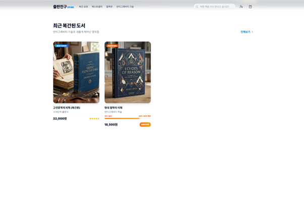

# [붙임 2-1] 신기술활용 우수사례 기획서

| 제4회 문화체육관광 인공지능·데이터 활용 공모전 - 신기술활용(ADX) - |
| --- |

# 

# 

| 공모 부문 | 신기술활용(ADX) 우수사례 |
| --- | --- |
| 사 례 명 | 공공데이터와 AI 에이전트를 활용한 절판 도서 복간 플랫폼, “출판친구” |
| 제품·서비스 유형 * 해당란에  표시 ※ URL 필수 기재 | □ 모바일 앱(APP)    URL 주소: |
|  | ■ 웹    URL 주소:  https://publish79.vercel.app |
|  | ■ 기타  <b>[평가위원 전용 실시간 온라인 데모 및 기능 검증 안내]</b> 1. ID: culture / PW: culture1234 2. 주요 검증 경로 ○ <b>[에이전트 통제실]</b> - 16대 에이전트 자율 협업 조직도/Top3도서/에이전트 실시간 로그 관제 - 카테고리(예: 소설, 인문학)를 선택하고 [🚀 파이프라인 실행] 클릭 시, 실시간 API 호출 ➔ 수요 온도 산출 ➔ 데이터 정제 및 DB 무결성 적재(Upsert)가 수행되며, 각 에이전트의 작동 상태 불빛(대기-회색/작동-주황/완료-초록)이 실시간으로 동적 연동 및 점멸하는 과정 검증. - [종이책 POD]: 소설 등 보호 도서의 경우 낱장/연속지 설비 한계를 고려한 "A5 판형 최적화(인쇄 원가 33.3% 절감)" 추천 카드 노출 및 자동 리플로우 조판(93% 정밀 축소)된 인쇄용 PDF 즉시 컴파일/다운로드 검증. - 헬퍼창의 대표 승인 확인 후 에이전트 자율 협업 모달창이 열리며 최적안 도출 및 내지 및 표지 파일 생성 - [ePub3 전자책]: 저작권 만료 도서의 경우 ePub3 뷰어가 자동 팝업되어 터치 액션 및 TTS(음성 합성) 오디오 낭독 엔진의 실시간 재생/스레드 자원 제어 검증. ○ <b>[출판친구 비즈니스 엔진]</b> - 통제실 우측 상단의 출판친구 클릭 후 진입 - 주문/정산 관리/파트너사 정보 등 핵심 실무 비즈니스 엔진 기능 검증. |
| 1) 제품·서비스 소개 및 목적(요약) |
| 20년 차 출판 POD 전문가가 AI 기술을 활용해 1인 개발한 플랫폼입니다. 매년 재고 부담으로 사장되는 품절·절판 도서를 해결하기 위해, 도서관 대출 빅데이터로 절판본을 감지하고 예약 결제 펀딩으로 제작비를 선확보합니다. 특히 AI 판형 최적화(A5)로 인쇄비를 33.3% 절감하며, 파트너 인쇄소 연계 온디맨드 생산 및 D2C 직배송을 실현합니다. 이를 통해 영세 출판사의 자본 리스크를 0%로 만들고 문화유산 보존과 독자 상생의 선순환을 목적으로 합니다. |
| 2) 제품·서비스 상세 설명 |
| ■ 서비스 구성 및 단계별 흐름    <b>1. 플랫폼 연동 구조 및 자율 협업 개요</b>   ○ 구글 제미나이(Gemini) API와 AI 개발 프레임워크인 안티그래비티(Antigravity)를 기반으로 구축하였습니다.   - 본 플랫폼은 1인 경영자(최종 승인자)와 안티그래비티 프레임워크 기반의 16대 협업 AI 에이전트 군단(출판친구 엔진)이 유기적으로 소통하며 작동하는 구조입니다.   - 효율성과 가독성을 위해 제작 아키텍처를 [종이책 복간 POD 사업부]와 [디지털 ePub 사업부]의 이원화된 스마트 팩토리 형태로 구성하여 병렬 가동합니다.    <b>[그림 1] 출판친구 플랫폼 이원화 자율 협업 구성도</b>       <b>2. 사업부별 단계별 자율 서비스 흐름 및 원고 기반 동적 분기</b>   <b>가. [종이책 복간 POD 사업부] 프로세스</b> (B2B 출판사 기존 도서 복간 & B2C/B2G 공유 도서 제작)   - <b>1단계 (수집/정제/분석)</b>: 1번 살피미가 도서관 대출 빅데이터에서 절판 도서를 탐지하고, 2번 다듬이가 표준 서지 메타데이터 정제 및 저작권 Heuristic 분류를 수행하며, 3번 계산이가 인쇄 요율 기반의 종이책 BEP 시뮬레이션을 진행합니다.   - <b>2단계 (의사결정/제안)</b>: 16번 판다(지휘)가 비즈니스 컨텍스트를 종합하여 의사결정 카드를 생성하고, 대표자(운영자)가 이를 최종 승인하면 10번 영업이가 출판사에 맞춤형 BEP 복간 제안서를 발송합니다.   - <b>3단계 (판형 최적화 및 자동 조판)</b>: 출판사 1차 승인 시 A5 판형 최적화(33.3% 절감안)를 추천하고, 동의 시 8번 이지퍼비터_POD가 원본 PDF를 A5 규격(93% 축소 및 여백 보정)으로 자동 조판하여 최종 PDF를 컴파일하고 출판사의 최종 승인을 받습니다.     * <i>(텍스트/원서 유입 시)</i>: 4번 고치미(교정), 5번 번역이(번역), 6번 조판이(조판), 7번 그림이(일러스트)가 차례대로 가동하여 인쇄용 완제품 PDF를 새로 생성하는 Full Compile 트랙으로 동적 전환됩니다.   - <b>4단계 (마케팅 및 예약 등록)</b>: 11번 알리미가 숏폼/카드뉴스 홍보물을 생성하여 배포하고, B2C 독자 예약 결제(빌링키)를 등록합니다.   - <b>5단계 (결제/제작 및 배송)</b>: 목표치(BEP) 달성 시 예약 결제를 일괄 격발하고, 파트너 인쇄소에 자동 발주를 진행하여 무재고 롱테일 제작 및 독자 직배송을 완료합니다. |
| 3) 제품·서비스 차별성 |
| ■ 비즈니스 및 시장적 차별성 (D2C 혁신 및 수익 다변화)    <b>1. 유통 마진 개편을 통한 공급률 개선 (D2C 유통 혁신)</b>   ○ D2C 자율 물류 유통망 구축   - 독자 주문 즉시 중간 유통망 없이 제휴 POD 인쇄처로 주문 정보가 즉시 라우팅됩니다.   - 인쇄 완료 후 독자 직배송을 통하여 물류창고 보관료와 중간 유통 수수료를 혁신적으로 최소화합니다.   ○ 플랫폼 수수료 최소화를 통한 출판사 공급률 극대화   - 유통 마진 혁신을 통해 출판사 공급률을 기존 60%에서 90% 수준으로 복원하고 소량 주문 생산(POD) 도서의 마진율을 극대화합니다.    <b>2. 자본 및 행정 리스크 0%의 예약 펀딩 결제</b>   ○ 예약 결제 시스템 도입 및 설계   - 빌링키 기반 예약 결제를 도입하여, 펀딩 목표 수량(손익분기점) 달성 시에만 일괄 결제가 수행되도록 설계하였습니다.   ○ 자본 및 행정 비용 리스크 차단   - 선제작비 확보 후 인쇄에 돌입하므로 자본 리스크가 없으며, 펀딩 실패 시 취소/환불에 따른 무용한 행정 비용 지출을 0%로 통제합니다.    <b>[그림 2] B2C 독자 예약 펀딩 및 게이지 바 UI</b>       <b>3. B2C 독자 펀딩과 B2G 도서관 공급의 투트랙(Two-Track) 비즈니스</b>   ○ 온·오프라인 공급 채널 다변화   - 일반 독자 대상의 예약 판매(B2C)와 더불어, 공공도서관 대출 빅데이터를 기반으로 사서용 납품 제안서를 자동 생성·접수하는 공공도서관 공급(B2G)을 병행합니다.   ○ 플랫폼 우회 제작 차단 및 락인   - 유통사를 배제한 D2C 직납망을 연계함으로써 출판사가 플랫폼을 우회하여 제작하는 '정보 먹튀' 문제를 원천 차단하고 강력한 B2B 락인(Lock-in) 효과를 창출합니다.    <b>4. 무재고 롱테일 경제성 지수 및 실증 비교</b>   ○ 소량 주문 생산(POD) 환경에서 최적 판형 변환을 통한 경제성 입증   - AI가 제안하는 판형 최적화(A5 국판 변환) 적용 전/후의 상대적 원가 및 기대 수익 구조를 백분율 지수(전통 방식=100)로 환산하여 실증 비교한 결과는 다음과 같습니다.   ○ [50부 복간 기준 상대 원가 및 기대 수익 구조 비교표]    <table border="1" cellpadding="5" style="border-collapse: collapse; text-align: center;"><thead><tr style="background-color: #f2f2f2;"><th>구분 항목</th><th>기존 유통 방식 (전통 POD 유통 + 신국판)</th><th>출판친구 방식 (D2C 유통 + A5 판형 최적화)</th><th>비고</th></tr></thead><tbody><tr><td><b>도서 소비자 정가 지수</b></td><td>100</td><td>100</td><td>동일 기준 적용</td></tr><tr><td><b>유통사/플랫폼 수수료율</b></td><td>40%</td><td>10%</td><td><b>30%p 중간 유통 수수료 절감</b></td></tr><tr><td><b>출판사 공급률 (정가 대비)</b></td><td>60%</td><td>90%</td><td><b>출판사 수취액 1.5배 증가</b></td></tr><tr><td><b>내지 인쇄 원가 지수 (300p)</b></td><td>100</td><td>66.7</td><td><b>내지 인쇄 비용 33.3% 절감 (4판 배열)</b></td></tr><tr><td><b>후가공 원가 지수 (표지/제본)</b></td><td>100</td><td>100</td><td>동일 가공 사양 기준</td></tr><tr><td><b>권당 제작 원가 지수</b></td><td>100</td><td>76.5</td><td><b>총 제작 원가 23.5% 감축</b></td></tr><tr><td><b>권당 순수익 지수</b></td><td>100</td><td>215.8</td><td><b>권당 순수익 약 2.15배 폭증</b></td></tr><tr><td><b>50부 판매 시 총 순이익 지수</b></td><td>100</td><td>215.8</td><td><b>무재고 롱테일 유통 순수익 극대화</b></td></tr></tbody></table>   *※ 본 지표는 실제 제작 환경의 상대적 원가 비율을 나타내며, 파트너사 정보 보호를 위해 구체적인 원화 계약 단가는 표기에서 제외하고 지수화 처리함.*    ○ 절판 도서 연간 롱테일 복간 수익 시뮬레이션   - 1종 복간 후 연간 300부 판매 시: 12,300원 × 300부 = 연간 3,690,000원의 무재고 순이익을 창출합니다.   - 10종 복간 후 연간 각 300부 판매 시: 3,690,000원 × 10종 = 연간 36,900,000원의 순이익을 창출합니다.   - 결과: 출판사는 초기 자본 및 재고 비용, 창고 보관료 부담 없이 잠자던 절판 도서 10종을 플랫폼에 등록하는 것만으로 매년 약 3,700만 원 상당의 안정적인 추가 이익을 확보할 수 있습니다.    ■ 독보적인 기술적 우수성 (AI 에이전트 자율 오퍼레이션)    <b>1. 실물 인쇄 설비 규격 인지 기반의 원가 절감 및 자동 조판 기술</b>   ○ 물리적 판거리 분석을 통한 내지 인쇄비 33.3% 절감 실증   - 디지털 낱장 인쇄 장비가 수용하는 표준 전지 규격(315×467mm)의 기하학적 배열 한계를 AI가 계산합니다.   - 신국판 대비 가로·세로 규격이 약간 작은 A5 국판으로 판형을 변경하면, 동일 전지 한 면당 배열(Imposition)되는 페이지 수가 2페이지(2판)에서 4페이지(4판)로 2배 증가합니다.   - 이를 통해 실제 용지 사용량과 기계식 클릭 요금을 대폭 아껴, 내지 인쇄 공정 비용을 33.3% 절감하는 설비 가동 효율화를 이끌어냅니다.    <b>[그림 6] 인쇄 설비 규격(315x467mm) 기준 신국판(2판) vs A5 국판(4판) 임포지션 배열 비교도 (배치 예정)</b>    ○ 자동 조판 및 레이아웃 보정   - 출판사가 규격 조정을 승인하면 8번 POD인쇄_이지퍼비터_POD 에이전트가 내지 텍스트 레이아웃을 93% 비율로 자동 축소 및 정밀 보정한 인쇄용 PDF를 즉시 생성하여 제작 원가를 즉각 감축합니다.    <b>2. 11번 마케팅_알리미 에이전트 기반 자본금 0원 사전 마케팅 팩 지원</b>   ○ AI 기반 마케팅 에셋 자율 생성 및 배포   - 홍보 인력과 마케팅 예산이 전무한 1인 출판사를 보완하기 위해 책의 텍스트 본문을 정밀 분석합니다.   - 홍보용 카드뉴스(SVG/HTML Canvas 자율 합성 기술) 및 숏폼 동영상 제작용 TTS 나레이션 스크립트를 자율 생성하고 배포를 대행합니다.   ○ 출판사 무상 마케팅 공급   - 출판사는 초기 투자 비용 없이 타겟 독자 및 커뮤니티에 예약을 유도할 수 있는 고성능 AI 마케팅 시스템을 무상으로 연계 공급받습니다.    <b>3. 안티그래비티(Antigravity) 기반의 무인 자율 유지보수(Self-Healing) 및 RLS/Rate Limit 보안 관제</b>   ○ 에러 감시 및 자가 치유 자동 배포   - 시스템 에러 발생 시 12번 감시_눈치왕이 예외를 포착하고, 13번 자가치유_닥터가 코드를 자율 수정하여 GitHub에 PR을 발행하며, 14번 배포_배달이가 운영자의 모바일 디스코드 승인을 받아 Vercel 실서버에 무중단 배포를 완료합니다.   ○ 정보 자산 전수 스캔 및 보안 통제   - 개발/배포 시 API Key 등의 중요 자격증명이 평문 노출되지 않도록 15번 보안_보안관이 30초 주기로 전수 스캔 및 환경변수 강제 치환을 수행하며, RLS 철통 보안 및 API Rate Limit(호출 제한) 가동으로 디도스(D.o.S) 공격과 비용 폭탄을 원천 차단합니다.    <b>4. 최고의사결정 모방 학습(CEO Clone) 데이터 아카이빙</b>   ○ 대표 의사결정 추천 데이터 축적   - 의사결정 추천에 대하여 운영자가 내린 모든 [승인/반려] 결과와 해당 시점의 데이터 컨텍스트(도서 지표, 마진율 등)를 JSON 데이터 포맷으로 축적하여 향후 인공지능이 대표자의 비즈니스 가치관을 자율 학습 및 모방하도록 구현합니다.    <b>[그림 7] 대표자 의사결정 모방 학습(CEO Clone)을 위한 JSON 포맷 학습 로그 데이터 구조 예시 (배치 예정)</b>    ■ 중장기 기술 로드맵 및 OSMU 비전 (Global Digital Assetization)    <b>1. AI 에이전트 협업 체계 기반의 글로벌 디지털 자산(OSMU) 제작 파이프라인</b>   ○ 에이전트별 세부 역할 및 협업 시너지   - 6번 번역_번역이 에이전트: 해외 저작권 만료 명작(구텐베르크 프로젝트 등) 데이터를 자율 수집해 현대 한국어 어조에 맞게 고속 번역하거나, 반대로 국내 우수 절판본을 다국어로 번역하여 아마존 KDP 등 글로벌 플랫폼에 역수출하여 1인 기업의 글로벌 시장 개척을 지원합니다.   - 7번 삽화_그림이 에이전트: 번역된 원고의 서사와 핵심 장면에 어울리는 삽화 및 도서 표지 일러스트를 독창적으로 시각화하고 일관된 테마로 자율 생성합니다.   - 9번 디지털컴파일_이지퍼비터_ePub 에이전트: 완성된 번역 텍스트와 7번 에이전트가 생성한 시각 자산을 결합하여, 가변 오디오 동기화 및 터치 액션이 들어간 인터랙티브 전자책(EPUB3)을 컴파일합니다. 전문 퍼블리싱 대행비(최소 150만 원 이상)를 권당 2~3만 원 상당의 극소액 API 호출 비용 수준으로 감축하여 출판사에 무재고 디지털 자산을 영구 제공합니다.    <b>[그림 8] 번역/일러스트 결합 및 TTS·터치 액션이 탑재된 EPUB3 인터랙티브 전자책 빌드 화면 (배치 예정)</b> |
| 4) 제품·서비스 성과 및 기대효과 |
| ■ 제품·서비스 성과 및 기대효과 (Performance & Expected Benefits) 1. 출판사 관점: 재고 리스크 프리 및 마진율 극대화   ○ 원가 절감 및 마진율 극대화     - 판형 최적화(A5 국판) 및 AI 에이전트의 자동 조판 보정을 통해 내지 인쇄 비용을 33.3% 절감함.     - D2C 직납 유통 구조 혁신으로 플랫폼 수수료를 10%로 최소화하여 출판사 공급률 90%를 달성하며, 기존 유통망 대비 권당 순수익을 2.15배 증가시킴.    ○ 자본 리스크 및 고정 비용 제로화     - 빌링키 예약 결제 방식의 선예약 펀딩 연계로 목표 수량 미달 시 100% 자동 취소되어 초기 제작비 자본 리스크 및 환불 행정 리스크 0%를 실현함.     - 창고 보관료, 초기 선제작비, 미분양 재고 폐기 비용 등의 고정비 부담이 전혀 없는 100% 무재고 친환경 비즈니스 운영이 가능함.   ○ 롱테일 휴면 자산의 수익화     - 시장에서 잠자고 있던 절판 도서 10종 복간 시, 1종당 연간 300부 판매 기준으로 매년 약 3,700만 원 규모의 지속 가능하고 안정적인 추가 순이익을 창출함.  2. 인쇄 제조사(POD) 관점: 자동 물량 확보를 통한 가동률 안정화 및 설비 재투자   ○ 영업비용 제로 기반의 가동률 +20% 자동 인상     - 오늘날 종이 매체의 감소로 중소 인쇄소의 평균 가동률은 50%대를 오르내리며 심각한 경영난을 겪고 있으며, 이를 극복하기 위한 무리한 영업 활동으로 이중고를 겪고 있음.     - 플랫폼이 절판 도서의 복간 수요를 규격화하여 자동 공급함으로써, 인쇄 제조사는 별도의 영업비용 지출 없이 즉각적으로 가동률 +20%p 추가 상승 성과를 얻게 됨.   ○ 후가공 라인 정밀 정합성 및 가동률 70% 안정권 도달     - 후가공 라인(제본 2대 + 재단 2대) 기준, 1일 20시간 가동 시 연간 최대 케파는 150만 부임.     - 플랫폼을 통해 출판사 100개사(연간 30만 부 수요)만 참여해도 최대 케파의 20% 물량이 자동으로 확보됨.     - 이를 통해 인쇄소는 기존 50%의 저조한 가동률에서 70%의 손익분기 안전 가동 구간으로 단숨에 도입하여 무리 없이 안정적인 공장 가동이 가능해짐.   ○ 노후화된 후가공 설비 재투자 여력 마련     - 지속적이고 예측 가능한 20%의 고정 물량 확보로 현금 흐름이 개선되어, 그동안 자금 부족으로 미뤄왔던 노후 제본기 및 재단기 설비에 대한 재투자가 가능해짐.     - 이는 생산 효율 증대 및 작업 환경 안전성 개선으로 이어져 중소 인쇄 제조업의 장기적인 경영 안정화를 달성함. 3. 독자 및 사회/문화적 관점: 문화 자산 보존 및 친환경 ESG 실현   ○ 희귀 문화 자산의 복원 및 안심 예약 구매     - 시장성 부족으로 사라졌던 학술서, 희귀 도서, 비주류 문화 자산을 물리적 서적과 인터랙티브 전자책(EPUB3)으로 영구 아카이빙함.     - 빌링키 예약 제도를 통해 목표 미달성 시 수수료 없는 자동 취소로 독자에게 신뢰받는 안전한 소비 경험을 제공함.   ○ 무재고 온디맨드(POD)를 통한 친환경 ESG 실현 (연간 49.5톤 탄소 배출 원천 차단)     - 국내 출판사 도서 반품 및 재고 파쇄 실태 데이터 (출처: 한국출판문화산업진흥원):       * 높은 업계 반품률: 국내 단행본 출판물의 평균 반품률은 20% ~ 40% 수준(평균 30% 기준)으로, 출판 선진국인 독일(약 5%)에 비해 비정상적으로 높음. (출처: 한국출판문화산업진흥원 『출판산업 실태조사』)       * 반품 도서의 즉시 파쇄율: 서점을 떠돌다 상처 입고 반품된 도서 중 약 15%는 재포장 인건비가 책값보다 더 들기 때문에 출판사 창고에 입고되지도 못하고 물류센터에서 즉시 파쇄(폐기) 처리됨. (출처: 한국출판문화산업진흥원 『출판물류 및 유통 실태 연구』)     - 도서 1권당 탄소 배출량 근거 (출처: 한국환경산업기술원):       * 300페이지 도서 1권(약 500g 기준)을 생산하고 폐기하는 데 발생하는 이산화탄소량(벌목, 펄프 제조, 화학 인쇄, 보관 온실가스, 파쇄 소각 과정 포함)은 약 1.1kg CO2e임. (출처: 한국환경산업기술원 탄소배출량 계수 및 국립산림과학원 지표)     - 전통 유통의 한계 (평균 반품 및 파쇄 기준 탄소 낭비 실증):       * 아날로그 옵셋 인쇄의 기본 초판 수량(1,000부) 대비 평균 반품률 30%와 반품 중 파쇄율 15%를 적용하면, 도서 1종당 45권의 도서가 판매되지 못하고 물류 단계에서 그대로 파쇄 소각됨.       * 이는 출판사 1개사가 10종의 도서를 복간할 때마다 연간 약 495kg의 불필요한 탄소가 배출됨을 의미함.     - 출판친구의 혁신:       * 선주문 및 실시간 수요 기반의 100% 온디맨드 생산으로 반품률 0%, 재고 폐기율 0%를 구현함.     - 실증 데이터 (연간 약 49.5톤의 탄소 감축):       * 출판사 100개 참여(1,000종 도서) 기준, 기존 방식 대비 연간 45,000권의 도서 파쇄 및 폐기를 방지하여 **연간 약 49,500kg(49.5톤)의 탄소 배출을 원천 절감**하며 실질적인 탄소 중립을 달성함. |
| 5) 문화데이터 활용 |
| 1. 활용 데이터 및 오픈 API 목록 활용 데이터(명) 제공기관(명) 출처   플랫폼(명) URL 전국 공공도서관 인기대출 도서 및 소장도서 빅데이터 API 국립중앙도서관 도서관정보나루 https://www.data4library.kr/api 국가서지 표준데이터 및 한국문헌번호(ISBN/ISSN) API 국립중앙도서관 서지정보유통지원 시스템 https://seoji.nl.go.kr/archive/api.do 만료저작물 및 공공누리 자유이용 문화저작물 데이터 한국저작권위원회 공유마당 https://gongu.copyright.or.kr 실시간 도서 유통 상태(품절/절판) 및 판매처 정보 API ㈜알라딘커뮤니케이션 알라딘상품조회 OpenAPI https://www.aladin.co.kr/ttb/api/ItemLookUp.aspx 2. 문화데이터 출처, 내용 및 획득 방법   ○ 전국 공공도서관 인기대출 및 소장도서 빅데이터     - 내용: 전국 공공도서관의 실시간 대출 횟수, 인기 대출 도서 순위, 지역/연령별 소장 정보 및 대출 트렌드 통계 데이터입니다.     - 획득 방법: 도서관 정보나루에서 제공하는 RESTful Open API를 통해 발급받은 인증키를 활용하여, 주 1회 자율 쿼리(Query)를 수행하고 JSON 및 XML 포맷으로 데이터를 수집합니다.   ○ 국가서지 표준데이터 및 한국문헌번호(ISBN/ISSN) 정보     - 내용: 국내에서 정식 출판된 모든 절판/휴면 도서의 원본 판형(가로/세로 mm), 정확한 페이지 수, 저자 정보, 원래 발행 출판사 정보가 담긴 국가 표준 서지 메타데이터입니다.     - 획득 방법: 국립중앙도서관 서지정보유통지원시스템 API 연계를 통해 수시로 검색 요청을 송신하여 서지 데이터를 획득합니다.   ○ 공유마당 만료저작물 및 자유이용 저작물 데이터     - 내용: 저작재산권 보호 기간이 만료되었거나 기증되어 법적 분쟁 없이 자유롭게 번역, 재해석, 2차 저작물 제작(OSMU)이 가능한 공유 문화유산 텍스트 및 이미지 데이터입니다.     - 획득 방법: 한국저작권위원회 공유마당 오픈 API 허브를 연계하여 저작권 만료 명작 원문 및 삽화 데이터를 호출 및 다운로드합니다.   ○ 실시간 도서 유통 상태(품절/절판) 정보     - 내용: 시중 대형 유통망에서 취급하는 개별 도서의 실시간 판매 가능 여부, 품절 및 절판 상태 코드를 즉시 판별할 수 있는 민간 서적 유통 정보 데이터입니다.     - 획득 방법: 알라딘 개발자 센터 오픈 API를 통해 개별 도서의 국제표준도서번호(ISBN13) 기반 실시간 상태 조회 쿼리를 실행하여 데이터값을 획득합니다.  3. 제품·서비스 내 데이터 활용 목적 및 수행 역할   ○ 복간 유망 도서 탐지 및 복간 점수(Reprint Score) 자율 산출     - 1번 살피미 에이전트가 도서관 대출 빅데이터를 기반으로 수요 점수(60%)를 매기고, 알라딘 유통 API를 실시간 조회하여 얻은 희소성 점수(절판 100점, 품절 50점 - 40% 가중치)를 합산하여 **최종 복간 점수를 100점 만점으로 자율 계산**합니다.     - 이 복간 점수를 바탕으로 수요는 존재하지만 오프라인 시장에서 유통이 단절된 '진짜' 복간 대상 도서를 한 치의 오차도 없이 선별해 내는 중추적 역할을 수행합니다.   ○ 도서 규격 자동 교정 조판 및 서지 정보 연동     - 2번 다듬이 에이전트가 국가서지 표준 API로 책의 가로/세로 규격 정보를 가져오면, 8번 이지퍼비터(POD) 에이전트가 이를 인쇄 표준 사양(A5 국판)에 맞춰 텍스트 레이아웃을 93% 축소 정밀 보정하는 기본 메타데이터로 기능합니다.   ○ 글로벌 OSMU 번역 및 삽화 자동 컴파일     - 공유마당 저작권을 6번 번역이 및 7번 그림이 에이전트가 자율 연동하여 현대적 한국어/다국어 번역 및 본문 어울림 삽화를 자동 생성하고, 9번 이지퍼비터(ePub) 에이전트가 EPUB3 인터랙티브 전자책 자산으로 컴파일하는 기본 소스 역할을 수행합니다.  4. 데이터 전처리, 가공 및 연계 기술 (Data Processing)   ○ 표준 규격 필터링 및 데이터 전처리 (Preprocessing)     - 수집된 원시 데이터 중 유효하지 않은 ISBN 코드 및 결측값을 전처리 필터를 통해 걸러내고, 도서 분류 정보(KDC)를 12대 대표 카테고리로 통일 규격 정제합니다.   ○ 다차원 복간 시뮬레이션 데이터 가공 (Processing)     - 3번 계산이 에이전트가 대출 빅데이터(수요)와 유통 단절 지표(희소성)를 결합하여 제작 원가 시뮬레이션 데이터를 가공하고, 대표자 최고의사결정 카드 정보로 재생산합니다.   ○ 공공-민간 데이터 1:1 관계형 연계 (Linking)     - 공공 도서관 대출 빅데이터(도서관 정보나루), 국가 표준 서지 메타데이터(국립도서관), 그리고 실시간 상업 서점 유통 상태 API(알라딘)의 데이터를 **국제표준도서번호(ISBN13)를 매핑 키값으로 삼아 단일 결합된 다차원 데이터베이스로 자율 연계**합니다. |
| 6) AI 기술 활용 |
| ■ AI 기술 활용 1. 인공지능 기반 핵심 기술 스택 및 연동 모델     ○ 핵심 구동 엔진: 출판친구 엔진 (Publishing Friend Engine)     - 1인 개발자(운영자)와 안티그래비티가 합작하여 개발한, 출판사와 인쇄 제조사를 유기적으로 연결하는 플랫폼의 핵심 심장부입니다.     - 출판사가 시스템을 통해 자사 도서의 실시간 제작 공정 작업 현황 및 배송 상태를 한눈에 추적하고 파악할 수 있도록 중개 설계되었습니다.     - 데이터 기반의 유동형 단가 관리(Dynamic Pricing) 기능을 탑재하여 인쇄소와 최적의 단가 협약을 체결 및 연계하고 있으며, 현재 오프라인 실무 환경에서도 무결성을 입증받고 활발히 활용 중인 핵심 시스템입니다.   ○ 초거대 멀티모달 AI 모델 (Gemini API / LLM)     - 출판친구 엔진 위에서 작동하며 에이전트들의 두뇌 역할을 수행하는 초거대 언어 모델입니다. 도서 원고의 정밀 분석, 요약, 번역, 이미지 삽화 기획 및 최고의사결정 추천 지능을 제공합니다.   ○ AI 에이전트 자율 오퍼레이션 프레임워크: 안티그래비티(Antigravity)     - 출판친구 엔진이 지휘하는 16대 AI 에이전트가 교착 상태(Deadlock) 없이 실시간으로 협업하고 이벤트를 처리할 수 있도록 상태(State)와 흐름을 관제하는 프레임워크입니다. 2. 16대 자율 협업 AI 에이전트(Multi-Agent) 아키텍처 및 역할   ○ 데이터 분석 및 비즈니스 의사결정 에이전트군     - 1번 살피미: 도서 대출 빅데이터 및 도서 정보를 분석하여 복간 수요가 높은 후보 도서를 실시간 감지합니다.     - 2번 다듬이: 도서 메타데이터 표준화 정제, 저작권 권리 관계 파악 및 중소 출판사 필터링 가이드를 적용합니다.     - 3번 계산이: 판형 및 수량별 인쇄/제본/가공 사양을 출판친구 엔진과 실시간 연계하고, DB에 등록된 실서버 표준 요율표를 대입하여 손익분기점(BEP)과 출판사 기대 마진율을 다차원 시뮬레이션합니다.     - 10번 영업이: 도서관 및 출판사 맞춤형 복간 제안서 및 공공도서관 희망도서 신청 서류를 자율 작성하여 전송합니다.     - 16번 판다(지휘): 출판친구 엔진의 제어 하에 전체 에이전트들을 총괄 지휘하며, 운영자의 최종 승인/반려 패턴을 학습하는 대표자 분신(CEO Clone) 모델을 빌드합니다.   ○ 도서 제작 및 멀티미디어 컴파일 에이전트군     - 6번 번역이: 고어/외국어 원문을 현대 한국어 어조로 정밀 복원하거나 국내 도서를 글로벌 언어로 번역합니다.     - 7번 그림이: 도서 장르와 서사 흐름을 분석하여 본문에 최적화된 표지 및 삽화 일러스트를 자율 생성합니다.     - 9번 이지퍼비터(ePub): 번역 원고와 이미지 자산을 결합해 가변 오디오 동기화 기능이 탑재된 고부가가치 ePub3 인터랙티브 전자책을 빌드합니다.     - 8번 이지퍼비터(POD): 승인된 규격에 맞게 내지 레이아웃을 93% 축소 정밀 보정하고 인쇄용 PDF 파일을 자율 컴파일합니다.   ○ 마케팅 및 인프라 운영 에이전트군     - 11번 알리미: 책 본문을 파싱하여 SVG/Canvas 기반 홍보 카드뉴스와 AI TTS가 가미된 숏폼 홍보 동영상을 자동 제작하고 배포합니다.     - 12번 눈치왕: 플랫폼 내의 오류 및 시스템 예외를 24시간 감시하고 포착합니다.     - 13번 닥터: 눈치왕이 감지한 오류 코드를 직접 분석하여 자가 치유(Self-Healing)를 진행하고 GitHub에 PR을 발행합니다.     - 14번 배달이: 운영자의 디스코드 승인을 받아 수정한 소스코드를 Vercel 실서버에 실시간 무중단 배포합니다.     - 15번 보안관: 30초 주기로 보안 위협 요소 및 자격 증명 평문 노출을 감시하고, RLS 및 API 호출 제한을 철저히 차단합니다. 3. AI 기술 적용을 통한 서비스 가치 혁신   ○ 1인 기업의 한계를 극복하는 무인 자율 유지보수(Self-Healing)     - 시스템 장애 발생 시 인적 자원의 개입 없이 '눈치왕(감시)-닥터(자가치유)-배달이(배포)'로 이어지는 자율 루프를 가동하여 코드를 치유하고 배포를 완료함으로써 무중단 자율 경영을 달성합니다.   ○ 수동 편집 및 제작 공정의 100% 자동화 혁신     - 과거 전문 디자이너와 편집 개발자가 수작업으로 진행하던 인쇄 사양 조정(A5 국판 93% 정밀 축소) 및 인터랙티브 EPUB3 전자책 컴파일을 AI가 단 2~3분 만에 완성하여, 외주 비용을 기존 대비 90% 이상 절감하는 기술 혁신을 구현합니다. |

※ 기획서 작성 시 유의사항
- 10장 내외 자유형식으로 작성하되, 1~6번 필수 항목은 기획서에 반드시 명시하여 작성
- 제시한 목차(필수 항목 1~6번) 외 추가 내용이 있을 경우 별도 제목을 기재하여 작성  
- 제품·서비스 개발의 경우, 모바일 앱/웹 등 실행 여부 확인 가능한 자료 첨부 必
 (예: 캡처 이미지, URL, QR코드 등)
- 이미지 파일은 문서 내 포함 必

# 

# 

# 

# 

# 

# 

# 

# 

# 

# 

# 

# 

# 

# 

# 

# 

