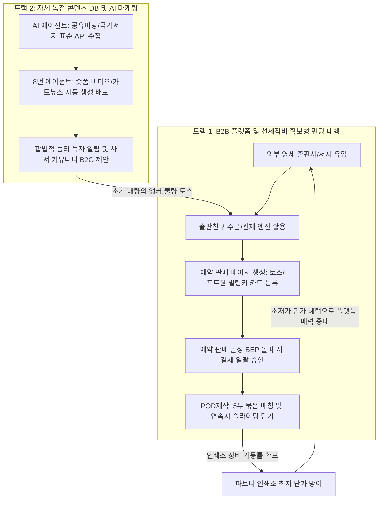
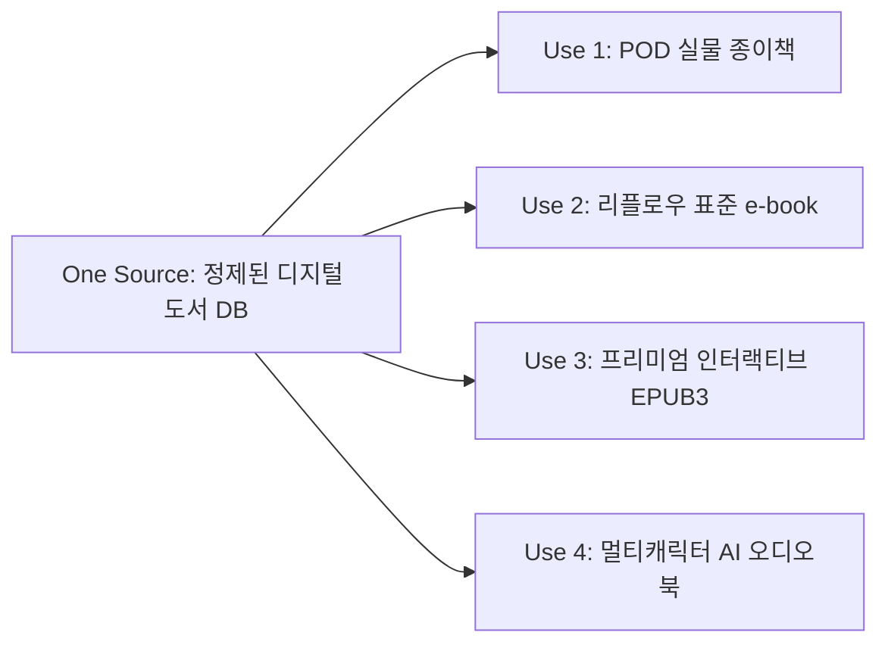

# [사업계획서] 출판친구의 비전: AI와 POD로 여는 글로벌 지식 재발견

## 1. 사업의 개요 및 잠재 시장 규모

본 사업은 국립중앙도서관 등 국가적 도서 아카이브의 방대한 **절판 도서 데이터**를 확보하고, 이를 **AI 기술**과 **주문형 인쇄(POD)** 기술을 결합하여 재고 리스크 없이 전 세계에 유통하는 지식 콘텐츠 재생 플랫폼입니다.

*   **대한민국 누적 단행본 발행 종수:** 약 150만 ~ 200만 종 (광복 이후 누적)
*   **잠재적 절판/품절 도서:** 약 **100만 ~ 150만 종** (전체 발행 도서의 70~80%)
*   **초기 확보 목표 라인업:** **10만 ~ 30만 종** (저작권 만료 도서, 고아 저작물, 출판 협의 가능 절판 도서 대상)

---

## 2. 투트랙(B2B 플랫폼 및 예약 펀딩 + 자체 IP) 및 용지·POD 공급망 전략

개인 독자를 모집하는 높은 마케팅 비용(B2C)을 우회하고, 자체 B2B 주문 관리 인프라와 AI 기반 독점 콘텐츠 자산(IP)의 시너지를 극대화하는 투트랙 전략을 가동합니다. 특히 펀딩 실패 시의 환불/취소 금융 수수료 및 정산 공수를 0%로 통제하기 위해 **'토스페이먼츠/포트원 빌링키 기반 예약 결제(Pre-authorization) 선제작비 확보 모델'**을 내장합니다.

1.  **트랙 1: B2B 플랫폼 비즈니스 (선제작비 확보 및 예약 결제)**
    *   **선제작비 확보 모델(Pre-production Cost Secured)**: 출판사 제안 및 계약 시, 출판친구 플랫폼 상에 '독점 예약 판매 페이지'를 개설합니다. 펀딩 기간 동안 독자의 결제 대금(인쇄에 필요한 최소 BEP 제작비)이 100% 모인 시점에만 제작에 돌입하므로 자본 리스크가 원천 차단됩니다.
    *   **빌링키 기반 예약 결제(Pre-authorization)**: 독자는 카드 정보만 등록하고 승인은 유예되는 '빌링키 예약'을 실행합니다. 펀딩 성공 시에만 일괄 결제가 발생하고, 실패 시에는 카드 정보만 삭제되므로 환불/취소 수수료 및 복잡한 정산 수작업이 발생하지 않아 1인 기업 운영에 최적화되어 있습니다.
    *   **소량 POD 제작 위탁 및 용지 중개**: 개별 출판사의 파편화된 소량 POD 도서들을 출판친구 엔진이 취합하고 묶음 발주하여, 하청 인쇄소와 계약된 **페이지당 고정 단가(디지털 낱장 및 디지털 연속지 슬라이딩 단가)**의 볼륨 할인을 달성하여 시장 경쟁력을 확보합니다.

2.  **트랙 2: 자체 독점 콘텐츠 DB 및 자율 마케팅 (초기 앵커 물량 확보)**
    *   **이원화 데이터 수집 구조**: 도서관 대출 인기 순위(B2B 적합)에만 의존하던 기존의 한계를 깨고, **한국저작권위원회 '공유마당' API** 및 **국립중앙도서관 '국가서지 표준데이터 API'**를 두 번째 핵심 채널로 결합합니다. 이를 통해 1956년 이전(사후 70년 이상 경과) 출판된 저작권 만료 도서의 서지 및 본문 정보를 다이렉트로 수집하여, 저작권료(인세) 0%의 고마진 독점 IP 라인업을 자율 확충합니다.
    *   초기 플랫폼 참여자가 적은 '닭과 달걀' 문제를 해결하기 위해, AI 에이전트로 복간한 자체 도서(구텐베르크 고전, 도서관 분실 도서 등)의 대량 주문을 우리 엔진에 태워 인쇄소에 상시 공급합니다.
    *   **8번 자율 마케팅 에이전트**가 도서 요약 쇼츠 숏폼 동영상 및 카드뉴스를 무상 자동 생성·배포하고, 플랫폼의 마케팅 수신동의 회원들에게 예약 알림을 송출하여 펀딩 성공률을 기하급수적으로 견인합니다.

---

## 3. AI 에이전트를 통한 생산 원가 혁신 (Unit Economics)

전통적인 도서 디지털화 방식(권당 15~30만 원) 대비, **AI 에이전트 파이프라인(OCR 보정, 스타일 자동화, 교정)**을 도입하여 초기 데이터 구축 비용을 90% 이상 낮췄습니다.

### 1권당 표준 원가 및 마진 구조 (정가 25,000원 기준)

*   **출판사 실매출 (공급가율 70% 평균):** **17,500원**
*   **인쇄 가공비 (POD 외주 하청):** -8,000원
*   **저작권료 (인세 평균):** -1,500원 (저작권 만료 0원, 살아있는 저자 10%, 고아저작물 2~3% 평균)
*   **초기 구축비 상각:** -1,000원 (AI 에이전트 도입으로 도서당 구축비가 약 1.2만 원으로 절감되어 40부 판매 시 상각 완료)
*   **1권당 최종 순이익:** **7,000원 (영업이익률 40%)**

---

## 4. 글로벌 유통 및 API 연동 드롭쉬핑(Dropshipping) 전략

자체 B2C 쇼핑몰 구축에 따른 마케팅 비용을 제거하고, 대형 서점 및 글로벌 플랫폼의 유통망을 100% 활용하는 API 연동 드롭쉬핑 구조로 운영됩니다.

### ① 대형 서점 API 연동 및 드롭쉬핑 (B2B2C)
*   교보문고, 예스24, 알라딘 등 국내 대형 온라인 서점에 당사의 복간 도서 및 번역서 DB를 API로 일괄 등록합니다.
*   독자가 주문하는 순간 실시간 주문 정보가 우리 플랫폼을 통해 파트너 인쇄소로 전송되며, 인쇄소에서 즉시 1부를 찍어 독자에게 직접 배송(Dropshipping)합니다. 재고 부담이 전혀 없는 100% 선결제 정산 모델입니다.

### ② B2G 도서관 총판 채널 및 희망도서 신청 자동화 (B2G Lock-in)
*   **개인정보보호법(PIPA) 준수**: 도서관 대출 예약자 연락처 직접 활용 등 불법적 개인정보 접근을 원천 배제하고, 독자 동의 기반의 플랫폼 오디언스 및 사서 연합 공식 커뮤니티(사서나라 등)를 통해서만 추천 제안을 배포합니다.
*   **희망도서 신청 자동화**: 스토어 예약 판매 페이지에 진입한 독자가 '우리 동네 도서관 희망도서 신청'을 클릭하면, AI가 해당 도서관의 구매 규격 포맷에 맞춘 희망도서 양식을 자동 작성하여 전송을 대행해 줌으로써 도서관 공공 구매 예산(B2G)을 합법적이고 강력하게 플랫폼으로 유치합니다.
*   **사서용 추천 공문 자동화**: 8번 에이전트가 책의 문학적/학술적 가치를 증명하는 사서 맞춤형 공식 품의 문서(PDF)를 생성하여 사서 커뮤니티에 자동 유포함으로써 도서관 납본 구매율을 극대화합니다.

### ③ 글로벌 outbound: 국내 도서 해외 수출 (Amazon KDP & Ingram)
*   가치 있는 국내 절판 도서를 **AI 번역 에이전트**를 통해 영문화하여 아마존 KDP 및 인그램에 등록합니다.
*   해외 주문 시 현지 글로벌 POD 망에서 인쇄되어 현지 배송되며, 유통 수수료 차감 후 공급율 약 40~46% 수준의 정산금이 안전하게 확보됩니다.

### ④ 글로벌 inbound: 해외 퍼블릭 도메인의 국내 번역 출판
*   해외의 저작권 만료 명작(구텐베르크 프로젝트 등)을 수집하여 **AI 번역 및 AI 레이아웃 에이전트**를 통해 한국어판으로 즉시 출간합니다.
*   원저작권 인세가 0원이며 번역 및 조판비가 거의 들지 않아 마진율을 극대화(권당 40% 이상 영업이익)합니다.

---

## 5. 종합 연간 매출 및 손익 시뮬레이션 (P&L)

본 플랫폼은 1인 창업자가 AI 에이전트 군단을 통해 100% 자율 운영하므로 고정 고용 인건비가 발생하지 않는 극단적인 고수익·저비용 구조를 가집니다.

### [1단계: 100% AI 자율 자율경영 (Zero-Labor) P&L - 낙관안 기준]

| 사업 부문 | 연간 수량 (부) | 정가 기준 매출액 | 출판친구 실매출액 (평균 70%) | 매출원가 및 상각비 | **부문별 순이익** | 비고 |
| :--- | :---: | :---: | :---: | :---: | :---: | :--- |
| **1. 국내 B2B/B2G 플랫폼** | 400,000 | 100.0억 원 | 70.00억 원 | 42.00억 원 | **28.00억 원** | 타사 주문 및 자체 복간 포함 |
| **2. 해외원서 국내번역** | 150,000 | 30.0억 원 | 19.50억 원 | 14.25억 원 | **5.25억 원** | 구텐베르크 등 인세 0원 |
| **3. 국내도서 해외수출** | 24,000 | 11.5억 원 | 5.28억 원 | 2.35억 원 | **2.93억 원** | 아마존 정산수수료 차감 |
| **합계** | **574,000** | **141.5억 원** | **94.78억 원** | **58.60억 원** | **36.18억 원** | **총 영업 마진율 38.2%** |

### [공동 고정비 (판관비 - 고용 인건비 0원 적용)]
*   인건비 (대표 1인 자율 운영 및 무고용): 0원
*   AI API 사용료 및 데이터 서버 유지비: 3.0억 원 (대용량 연동 가동비)
*   유통 파트너십 및 API 연동 마케팅비: 2.0억 원
*   기타 1인 오피스 유지 잡비: 0.2억 원
*   **총 판관비 합계:** **5.2억 원** (기존 인력 배치안 12.0억 원 대비 **6.8억 원 고정비 절감**)

### [최종 손익 결론 (1인 자율기업 최적화)]
*   **연간 실매출액:** **94.78억 원**
*   **연간 최종 순이익 (대표님 수취액):** **30.98억 원** (기존 24.18억 원 대비 **28.1% 순이익 증가**)
*   **매출 대비 최종 순이익률:** **32.7%**

---

## 6. 취급 도서 종수(SKU) 자율 확장에 따른 기하급수적 스케일업 전망

AI 번역 및 VDP 자동 조판 에이전트의 완성에 따라 취급 도서 종수(SKU)를 무제한으로 확장 등록할 수 있습니다. 3만 종 등록 기준 롱테일 법칙을 적용한 미래 스케일업 규모 예측입니다.

| 단계 | 누적 등록 도서 (SKU) | 연간 총 판매부수 | 정가 기준 매출액 | 출판친구 실매출액 (공급율 70%) | 최종 순이익 (대표님 수취액) |
| :--- | :---: | :---: | :---: | :---: | :---: |
| **보수적 최악 상황** | 약 3,000종 | 95,000부 | 23.2억 원 | **15.53억 원** | **2.78억 원** (영업흑자 생존) |
| **원래 계획안** | 약 10,000종 | 574,000부 | 141.5억 원 | **94.78억 원** | **30.98억 원** |
| **초고속 스케일업** | **약 30,000종** | **1,095,000부** | **273.7억 원** | **191.60억 원** | **71.45억 원** |

*   **스케일업의 본질**: 도서 데이터베이스가 축적될수록 고정비의 추가 지출 없이 매출액은 190억 원대, 영업 이익은 70억 원대 수준으로 무한 확장이 가능합니다.

---

## 6. 저작권 해결 방안 및 리스크 관리

출판친구는 저작권법을 준수하여 합법적인 콘텐츠 자산을 구축합니다.

1.  **퍼블릭 도메인 자동 필터링:** 사후 70년 경과 도서를 자동 선별하여 계약 프로세스 없이 고속 출판 파이프라인으로 이관합니다.
2.  **AI 기반 저작권자 추적 및 전자 계약:** 생존 저작자의 연락망을 AI로 추적하여, 자동 메일/SMS를 발송하고 비대면 전자계약 체결을 유도합니다.
3.  **법정허락 대행 자동화:** 연락이 닿지 않는 고아 저작물의 경우, 상당한 노력을 증빙하는 서류를 자동 생성하여 한국저작권위원회 공탁 절차를 밟습니다.

---

## 7. 중장기 비전: 지능형 OSMU(One Source Multi-Use) 및 프리미엄 인터랙티브 EPUB3 로드맵

출판친구의 최종 지향점은 1회성 종이책 복간을 넘어, 구축된 롱테일 도서 데이터베이스를 다각도로 재활용하는 **원소스멀티유즈(OSMU) 지식 자산 플랫폼**으로의 진화입니다.

### ① 프리미엄 인터랙티브 EPUB3의 개요 및 AI 제작 타당성
*   **EPUB3의 정의**: HTML5, CSS3, JavaScript를 내장할 수 있는 차세대 글로벌 e-book 표준 규격입니다. 일반 텍스트 위주의 e-book(EPUB2)과 달리 화면 터치 반응형 레이아웃, CSS 애니메이션 효과, 텍스트 싱크 맞춤 오디오 재생(Media Overlays) 등 웹 수준의 고차원 인터랙션을 지원합니다.
*   **AI 제작의 타당성**: EPUB3의 실체는 결국 웹 코드(HTML/CSS/JS) 패키지이므로, 코딩에 특화된 LLM(Gemini API)이 설계 및 생성에 압도적인 우위를 가집니다. AI가 도서 맥락을 이해하고 적절한 위치에 CSS 애니메이션 코드 및 오디오 싱크 XML을 자동으로 생성 및 주입할 수 있습니다.

### ② 획기적인 제작 비용 혁신 (Unit Economics Comparison)
*   **전통적인 제작 방식 (전문 인력 고용)**: 인터랙티브 EPUB3는 디자이너와 프론트엔드 개발자가 수작업으로 JS 인터랙션을 코딩해야 하므로 권당 **150만 원 ~ 400만 원**의 외주비가 들며 기간도 수주가 걸립니다.
*   **출판친구 AI 자율형 제작 방식**:
    *   **AI API 토큰 비용**: 약 $3.00 ~ $5.00
    *   **AI TTS 오디오 생성 비용 (멀티 캐릭터 목소리 포함)**: 약 $10.00 ~ $15.00
    *   **[결론]** 권당 **약 2만 원 ~ 3만 원 이하**로 제작 가능 (**원가 99% 이상 절감**). 
    *   재고 비용이 0원인 디지털 파일 특성상, 한 번 제작해 두면 판매 시마다 순이익률 90% 이상의 마진을 평생 가져다주는 초고수익 캐시카우가 됩니다.

### ③ 단계별 스케일업 로드맵
*   **1단계 (초기 - 현재)**: 공공데이터 연동 ➔ 4번 VDP 엔진을 통한 POD 실물 도서 복간 및 대형 서점 유통망 정착.
*   **2단계 (중기 - 1~2년 차)**: AI 번역 및 자동 EPUB 변환기 연동 ➔ 표준 e-book(EPUB2/3) 교보/예스24/알라딘 무제한 자동 등록 유통.
*   **3단계 (장기 - 3년 차~)**: 동아시아 고전 및 절판 원서 중심의 프리미엄 인터랙티브 에디션 출시 ➔ AI 성우 결합 오디오북 및 태블릿 전용 고가 리치 미디어 북 시장 개척.
